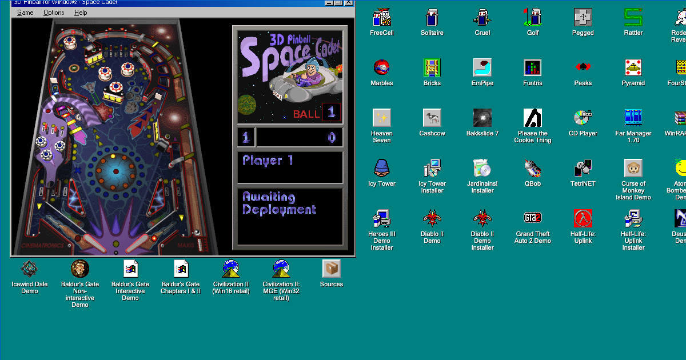
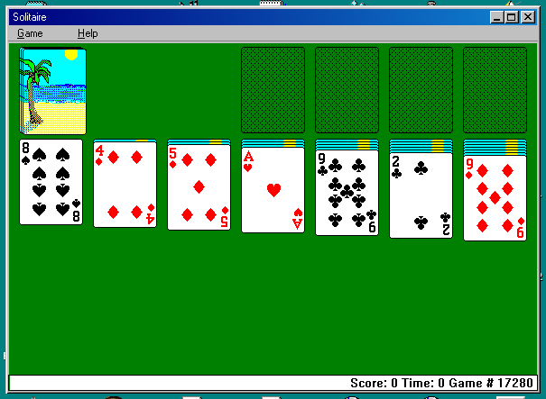
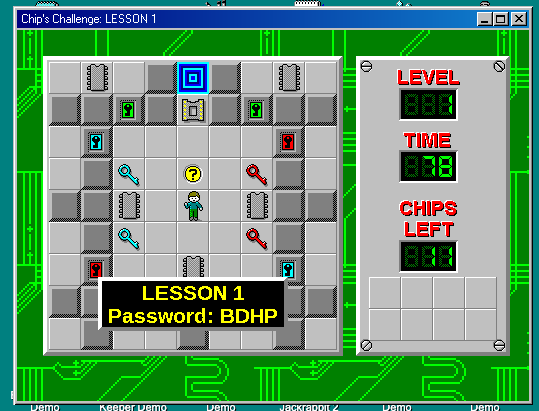
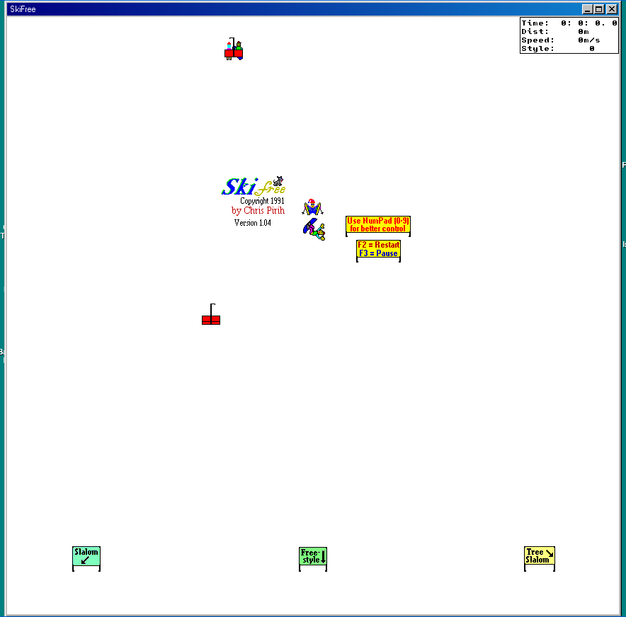
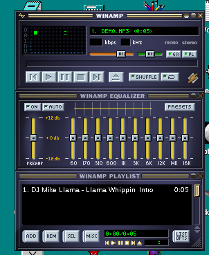
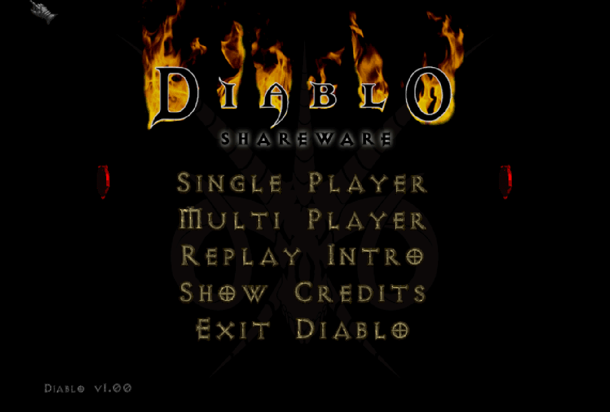
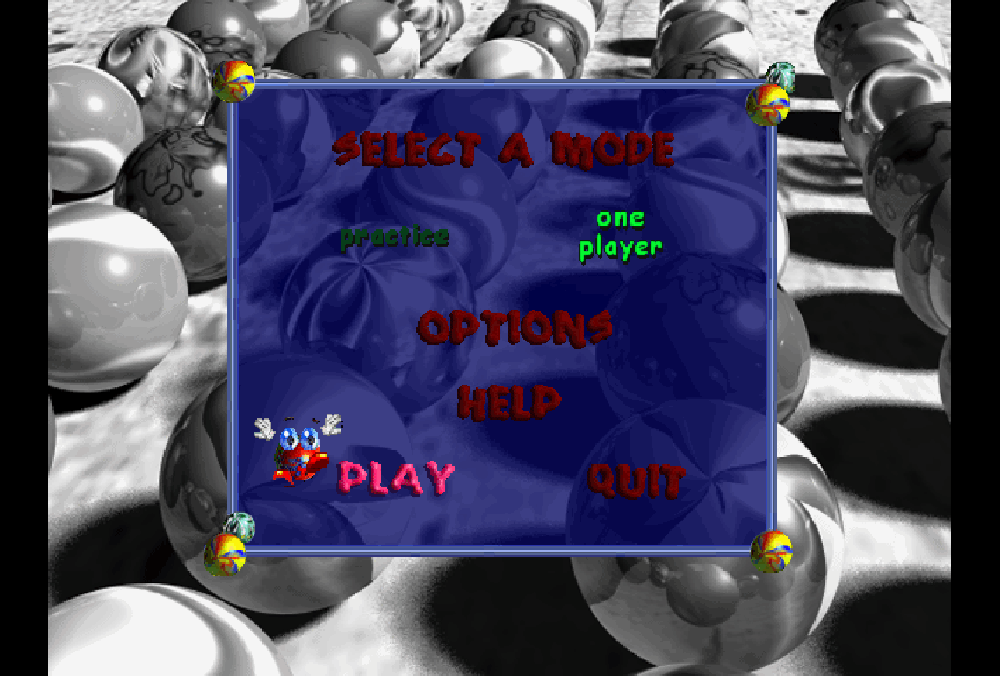
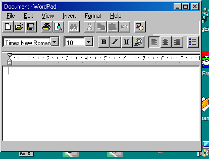
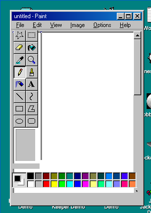

# Wine-Assembly: run real Windows 98 apps and games in your browser

**[Try it now → wine-assembly.berrry.app](https://wine-assembly.berrry.app)** · [Apps you can run](https://wine-assembly.berrry.app/apps/) · [The story of how it was built](https://wine-assembly.berrry.app/story.html) · [Articles on how it works](https://wine-assembly.berrry.app/articles/) · [Design docs & reverse-engineering notes](https://wine-assembly.berrry.app/docs/)

[](https://wine-assembly.berrry.app)

Wine-Assembly is a **Windows 98 emulator for the browser** that runs the original, unmodified `.exe` files. There is no operating-system image to boot and no source port to maintain: an x86 interpreter and a reimplementation of the Win32 API are written directly in WebAssembly Text (WAT), and the program's own machine code runs on them. Pinball, SkiFree, Solitaire, Minesweeper, Notepad, Paint, Winamp, DirectX games and 16-bit Windows 3.1 programs all launch in a tab, on desktop and on a phone.

<a href="https://www.producthunt.com/products/wine-assembly?embed=true&amp;utm_source=badge-featured&amp;utm_medium=badge&amp;utm_campaign=badge-wine-assembly" target="_blank" rel="noopener noreferrer"></a>

Large parts of the reverse engineering, implementation, testing, and documentation were developed in collaboration with Claude Code and Codex. [PROJECT_STORY.md](PROJECT_STORY.md) reconstructs that history from Git and the agent sessions that built it.

## What runs

| | | | |
|:-:|:-:|:-:|:-:|
| [](https://wine-assembly.berrry.app/?app=sol) | [](https://wine-assembly.berrry.app/?app=wep16_chips) | [](https://wine-assembly.berrry.app/?app=ski32) | [](https://wine-assembly.berrry.app/?app=winamp) |
| Solitaire | Chip's Challenge (Win16) | SkiFree | Winamp 2.91 |
| [](https://wine-assembly.berrry.app/?app=diablo_shareware) | [](https://wine-assembly.berrry.app/?app=marbles) | [](https://wine-assembly.berrry.app/?app=wordpad) | [](https://wine-assembly.berrry.app/?app=mspaint) |
| Diablo shareware | Marbles (DirectDraw) | WordPad | Paint |

Every tile links to that app on the live site. All screenshots are the emulator's own output, captured headlessly from the real binaries.

- **Games:** 3D Pinball Space Cadet, SkiFree, Solitaire, FreeCell, Minesweeper (Win98 and XP), the Windows Entertainment Pack (Golf, Reversi, Pegged, Taipei, TicTactics, Rattler Race, Cruel), Chip's Challenge, Rodent's Revenge, Icy Tower, DX-Ball, Marbles, and the 16-bit Windows 3.1 originals of the Entertainment Pack
- **Windows 98 accessories:** Notepad, WordPad, Calculator (standard and scientific), Paint with all 16 tools, RegEdit, Sound Recorder with microphone capture, Volume Control, Task Manager, the WinHelp viewer
- **Winamp 2.91 and 2.95:** skinned multi-window UI, MP3 playback, visualization, and the NSIS installers themselves
- **DirectDraw, Direct3D, DirectSound, DirectInput:** the DirectX 5 SDK samples, Plus! 98 screensavers, and startup or gameplay paths for Diablo, Age of Empires, RollerCoaster Tycoon, Caesar III, Heroes of Might and Magic II, Jazz Jackrabbit 2, Quake II and other demos
- **Real DLLs:** msvcrt.dll, mfc42u.dll, comctl32.dll, RichEdit and other Win32 libraries load with relocations, so MFC applications run against the real runtime
- **Networking:** a virtual LAN where two browser tabs, or two emulator processes, play Hearts and Liquid War against each other over Winsock and DDEML

The smoke matrix tracks 114 binaries. Its latest recorded complete run reported 81 PASS, 29 WARN/known-limited, 4 expected 16-bit skips, and no unexpected crashes. Focused tests go much deeper than that startup gate for the apps above.

## How it is different from v86, 98.js, Webamp and js-dos

| Project | What it does | Wine-Assembly |
|---|---|---|
| **[v86](https://copy.sh/v86/)** | Full PC emulator that boots a whole operating system from a disk image | Skips BIOS, kernel and disk: loads the PE file directly, so an app starts in seconds instead of booting Windows |
| **[98.js](https://98.js.org/)** | Pixel-faithful JavaScript recreation of the Windows 98 desktop | Runs the actual `mspaint.exe` and `notepad.exe` that shipped with Windows 98, not a rewrite |
| **[Webamp](https://webamp.org/)** | Winamp 2 reimplemented in HTML5 | Runs the actual `winamp.exe`, plus a hundred other unmodified binaries |
| **[js-dos](https://js-dos.com/)** | DOSBox compiled to WebAssembly with Emscripten | Targets Win32 and Win16 rather than DOS, and is written in WAT by hand rather than compiled from C |
| **[Wine](https://www.winehq.org/)** | Win32 API on Linux and macOS, native CPU | The same idea, in a browser tab: the Win32 API is reimplemented, but the x86 code is interpreted in WebAssembly |

## How it works

1. **PE loading.** The PE header is parsed and its sections mapped into WASM linear memory. Imports are resolved through an FNV-1a hash table from API name to handler ID.
2. **x86 decoding.** Each basic block of x86 code is decoded once into a sequence of `(opcode, operand)` pairs in a threaded-code cache. A dispatch loop calls handlers through an indirect call table, with tail calls where the engine supports them.
3. **Lazy flags.** CPU flags are not computed after every instruction. The operands and operation are saved, and ZF, SF, CF and OF are computed only when a conditional jump or `SETcc` reads them.
4. **Win32 API in WAT.** Every imported function is replaced by a thunk. When execution reaches one, a `br_table` dispatches to a WAT handler that implements the API: windows, messages, GDI, files, registry, threads, COM, DirectX, Winsock.
5. **Software GDI.** Window state, regions, clipping, fonts and rasterization live in WAT. JavaScript uploads pixels, composites windows onto a canvas, and delivers input.
6. **Real DLLs and COM/OLE.** Win32 DLLs load with relocations and import patching. The compatibility layer implements bounded COM, OLE data transfer, structured storage and DirectX interfaces.
7. **Win16.** 16-bit NE executables load into a segmented arena with selectors and ordinal imports, so Windows 3.1 programs run beside their Win32 successors.

[docs/memory-map.md](docs/memory-map.md) compares the emulator's memory layout with the Windows 98 kernel and user model. [docs/](docs/) holds the design notes: dispatch performance, the loop-idiom superinstructions, the software rasterizer, real threads, the virtual LAN. [docs/re-notes/](docs/re-notes/) has one file per game or application taken apart to make it run.

## Quick start

### Browser

```bash
bash tools/build.sh
python3 -m http.server 8080
# Open http://localhost:8080/index.html
```

Select an application from the dropdown and click Launch, or double-click a desktop icon. `?app=ID` deep-links straight into one app, for example `?app=pinball`.

On iPhone and iPad, open the live demo in Safari and use **Share → Add to Home Screen** to run it as a standalone web app. Touch input maps to the Windows 98 mouse, and a hidden keyboard proxy lets the iOS keyboard type into canvas-backed controls.

#### Safari Private Browsing

Safari Private Browsing's tracking and fingerprinting protections can make WebAssembly extremely slow. In Safari, choose **View → Reload Reducing Privacy Protections**, or use a non-private window. See [docs/safari-private-browsing.md](docs/safari-private-browsing.md) for the measurements.

### Command line

```bash
node test/run.js --app=sol                         # by registry id, same files the desktop mounts
node test/run.js --exe=test/binaries/notepad.exe   # any PE
node test/run.js --app=pinball --png=out.png       # render the final frame
```

Key flags: `--trace-api` logs every Win32 call, `--trace-gdi` every drawing primitive, `--break=0xADDR` and `--break-api=Name` pause the emulator, `--input=BATCH:ACTION:ARGS` injects keys and clicks, `--threads` gives each guest thread a real worker. [CLAUDE.md](CLAUDE.md) documents the full tracing and debugging toolkit.

## Building

Requires Node.js. The project uses its own WAT compiler (`tools/build-compile-wat.js`) rather than `wat2wasm`, and writes both a tail-call build and a compatibility build:

```bash
bash tools/build.sh
```

The build runs the gates listed in [CLAUDE.md](CLAUDE.md), concatenates `src/*.wat` in the order `src/main.watx` names, and compiles `build/wine-assembly.wasm` and `build/wine-assembly.compat.wasm`, about 1 MB each.

## Architecture

Everything that is the emulator is WAT: x86 decoding, memory management, PE, DLL and NE loading, the Win32 API, COM/OLE, DirectX, structured exception handling, window and control logic, menus, dialogs, fonts and the software rasterizer. That is about 210,000 lines across 61 source parts. The host, in JavaScript for the browser and Node.js, provides canvas presentation, file and network I/O, audio output, input and timers, and about 270,000 lines of tests and tooling.

```
src/                WAT source; src/main.watx lists the compile order
src/api_table.json  Win32 API name -> handler ID mapping
lib/                Host libraries: renderer, DLL loader, filesystem, threads
index.html, host.js Browser frontend
test/               CLI runner, test binaries, ~850 regression tests
tools/              Build, code generators, disassembler, PE tools, profilers
docs/               Memory map, design notes, per-app reverse-engineering notes
```

## Frequently asked questions

**Is this a virtual machine running Windows 98?**
No. Nothing from Windows is booted. The program's own x86 code is interpreted, and every Windows function it calls is reimplemented inside the WebAssembly module.

**Can I run my own .exe?**
Yes. Drop a Win32 or Win16 executable, a ZIP, or a CD image onto the desktop. Applications that only use APIs already implemented run; an unimplemented API stops with a message naming it.

**Is it fast?**
It is an interpreter, so roughly a 1997-class machine on a modern laptop. Pinball, Winamp and the DirectDraw games run at full speed; heavier 3D titles do not yet.

**Why WAT instead of compiling an emulator from C or Rust?**
Because the goal was to find out what a WebAssembly-native emulator looks like: no toolchain between the design and the bytes the engine runs, and every byte of the 1 MB module accounted for.

## License

MIT
