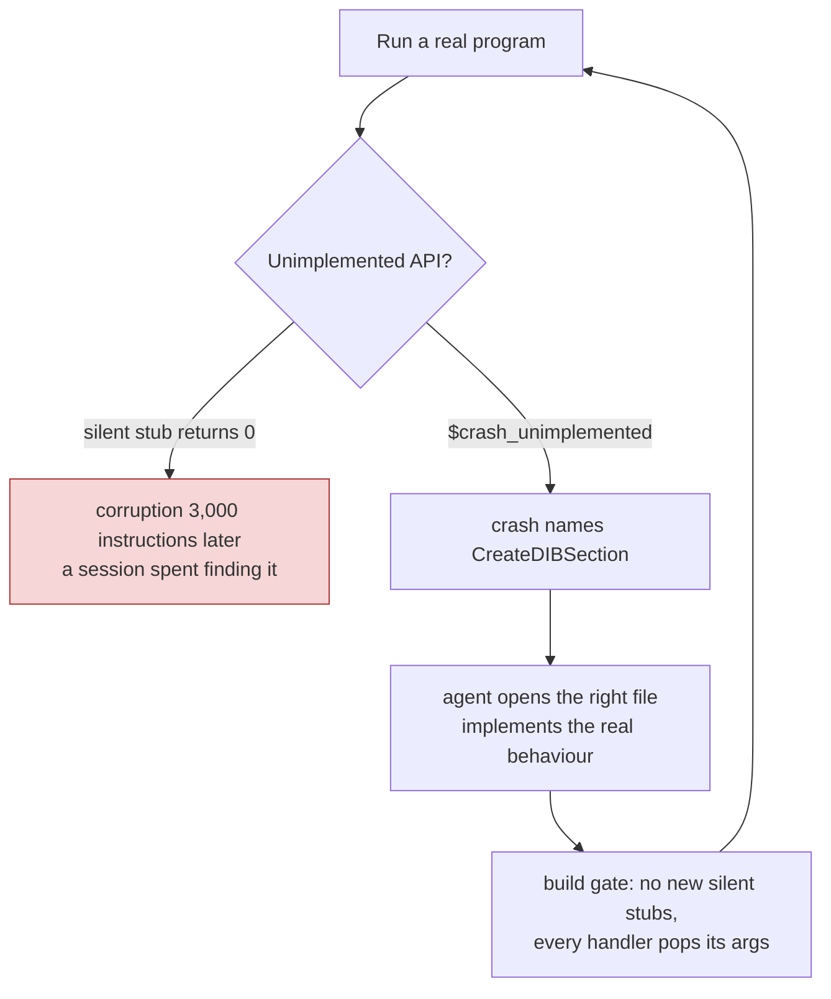
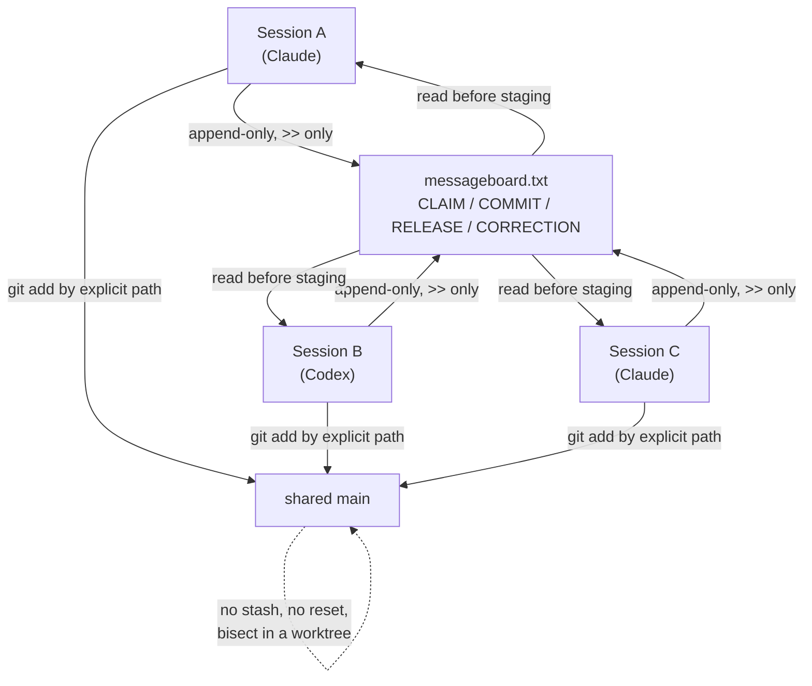

# Building an emulator with AI coding agents: what 3,700 commits with Claude Code and Codex taught
<!-- description: What 3,700 commits with Claude Code and Codex taught: crash instead of stub, record what failed, measure honestly, and many agents in one source tree. -->

Wine-Assembly, a Windows 98 emulator written in WebAssembly Text, was built in about five months by one maintainer working with Claude Code and Codex, often several agent sessions at once in one repository. The record of that collaboration is unusually complete: 3,758 commits, 431 Claude sessions, 118 Codex rollouts and a 4,400-line shared message board, all reconstructed in [the project story](/story.html). This article pulls out what actually made it work, for anyone trying to run systems work with coding agents rather than demos.

## Give the agent a crash, not a wish

The single most important practice was a rule about stubs. When an unimplemented Windows API is hit, the emulator traps with `unreachable` and names the function; it never returns 0 and carries on. A silent stub turns "implement `CreateDIBSection`" into "why is the installer's tree view invisible three thousand instructions later", and an agent given the second problem burns a session on it. Given the first, it opens the right file. The rule is enforced by a build gate, and its origin is the second week of the project, when fourteen early silent stubs were converted to traps and a string of mystery bugs went away.

The same logic produced the tracing flags. Rather than have each session add `console.log` lines that rot, the CLI grew a flag for every question that recurred: which API was called with what, which file was probed, which registry key, which routing branch swallowed a click, which control painted where. A new session starts with `--trace-api` instead of an edit, and the flag outlives the session.

## Write down what was ruled out

The project's `docs/` directory contains as many negative results as designs. Compiling whole pages of code ahead of time: measured, dead even. Inlining the dispatcher into every handler: no gain. A control-flow fold that removed a jump chain: about zero. Each is a document with the numbers, and each exists so that a later session, or a later agent, does not spend a day rediscovering it. The per-application [reverse-engineering notes](/docs/re-notes/) do the same for games: load addresses, identified functions, and the hypotheses already eliminated, so the same disassembly is not redone.

Agents are very willing to try the obvious thing. The counterweight is a record of which obvious things were already tried.

## Measure in units that do not lie

Several weeks of the story are about measurement mistakes rather than emulator bugs: a "frozen" video that was really a pacing artefact of the headless clock, a benchmark unit (batches) that changed meaning by 41x between two screens of the same game, a machine at load 30 making a 24% regression appear and disappear. The responses became rules: quote ops or wall time for fixed work, never per-batch numbers; run A/B arms interleaved in one process; check `uptime` before trusting a browser number; count presented frames, never API calls, when quoting a game's speed. An agent will happily optimise a number that is not measuring anything, so the maintainer's job shifted toward deciding what the number is.

## Many agents in one tree

By late August 2026 there were often five to ten sessions working in the same checkout, and the peak day, August 31, has 288 commits and 96 distinct agent-day rows on the board. The coordination mechanism is deliberately low-tech:

- An **append-only message board** file, written only with `>>`, where each session claims files, announces commits and posts corrections as new lines. A middle edit is forbidden, because another session may be tailing the file.
- **Commit by explicit path.** With a shared index, `git add -A` or a bare `git commit -a` takes another session's staged work. Every session stages the files it owns and nothing else, after reading the board.
- **No `git stash`, no resets, no history rewrites** from an agent. Bisects happen in a separate worktree.
- **Fix, do not revert.** A refactor that broke something is debugged to the cause; "revert the safe slice" was banned after it hid a real bug twice.

Most of these rules were written down as *memory* entries after an incident, in the form "what happened, why, how to apply", and are loaded into every new session. The story's later acts record the incidents that produced them.

## What the maintainer still does

The division of labour that emerged is not "the agent writes code". The agent does reverse engineering, implementation, tests and documentation at a pace no one person could sustain; the maintainer picks targets, decides what is worth measuring, refuses fake progress, and says no to language features and architectural changes until the case is made in a document. The larger design decisions in the story, moving logic from JavaScript into WAT, the software GDI, the compiler that allocates the memory map, were all argued in a design doc before a line changed, and several of those docs were rejected.

The honest summary is that agents made the project possible and made a specific kind of discipline necessary. The discipline is mostly about information: crash early, trace instead of guess, record what failed, measure what matters, and never let two sessions write to the same state without a note.

## Further reading

- [The story](/story.html), §4 "Patterns that emerged" and §8 "The narrative arc", for the timeline and the maintainer's own words.
- [The compiler that owns the memory map](/articles/watx-compiler-allocated-memory-map.html), the largest change made this way.
