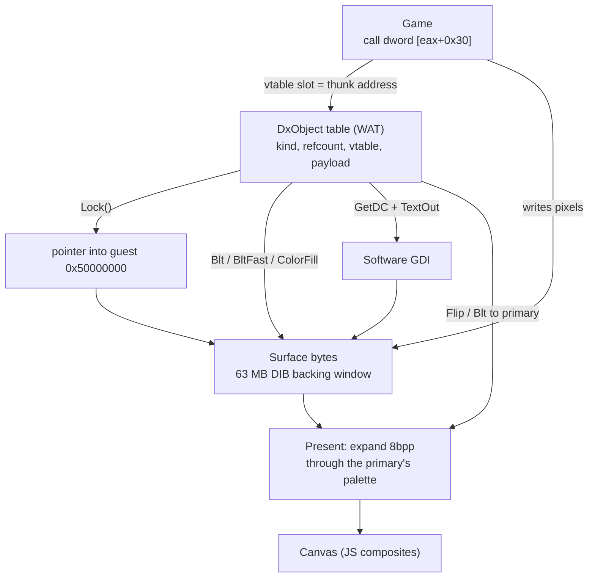

# DirectDraw and Direct3D in the browser: running 1990s DirectX games in WebAssembly
<!-- description: How DirectDraw and Direct3D are implemented in WebAssembly: COM vtables through thunks, lockable surface memory, 8-bit palettes, and what each game needed. -->

Diablo, StarCraft's title screen, Jazz Jackrabbit 2, Caesar III, Age of Empires, the Plus! 98 screensavers and the DirectX SDK samples all talk to the display through DirectDraw and Direct3D. Wine-Assembly implements those COM interfaces in WebAssembly Text, backs every surface with memory the game can lock and write, and composites the result onto a canvas. This article covers how the COM layer is dispatched, how surfaces and palettes work, and how far the 3D side goes.

## COM vtables through the thunk zone

A DirectX object is a pointer to a pointer to a vtable, and games call methods through it with `call dword [eax+0x30]`. The emulator builds each vtable out of *thunk addresses*, the same reserved range the [Win32 API](/articles/win32-api-in-webassembly.html) uses, with one id per interface method. `IDirectDrawSurface_Lock` is an entry in `src/api_table.json` like `CreateWindowExA`, the interface's start id is computed from its name prefix by the generator, and the handler receives `this` as its first stack argument.

Objects themselves are `DxObject` records in a WAT-owned table (`src/09a8-handlers-directx.wat`): kind, refcount, vtable pointer, and a per-kind payload. Two rules from the project's memory notes shaped the layer:

- **`QueryInterface` must `AddRef`** even when it hands back the same object. An early version reused the slot without counting, and the game's matching `Release` freed a surface still in use.
- **Read the caller's `dwSize`.** Every DirectX struct starts with its size, and versions differ. `GetCaps`, `GetSurfaceDesc` and `SetDisplayMode` fill only what the caller declared, or they overwrite the caller's stack.

`QueryInterface` for a newer interface version (`IDirectDrawSurface` to `IDirectDrawSurface3`, surface to texture) returns a wrapper with the other vtable, not the same slot upgraded in place, because games hold both pointers at once.

## Surfaces are memory

`Lock` has to return a pointer the game can write pixels through. Surfaces are therefore DIB-shaped buffers in a dedicated 63 MB backing window, mapped into the guest at `0x50000000`, so a locked surface is ordinary guest memory. `Unlock`, `Blt`, `BltFast` and `Flip` operate on that memory in WAT: `Blt` does a nearest-neighbour stretch when the rectangles differ (the WIN98 screensaver's doubled logo), `BltFast` honours `DDBLTFAST_SRCCOLORKEY` for sprite transparency, and `ColorFill` fills.

Most of these games run at 8 bits per pixel with a palette. The palette bound to the *primary* surface, set by `IDirectDrawPalette::SetEntries`, is what the present step uses to expand the 8-bit surface to RGBA for the canvas. A surface can also have a GDI DC (`GetDC`), so a game that draws its menu text with `TextOut` onto a DirectDraw surface goes through the software GDI and back into the same bytes.

Presenting is an explicit step (`Flip`, or `Blt` to the primary), and the browser's `PRESENT/s` counter in the perf HUD counts those. The headless CLI's `--dx-surfaces` flag lists every live surface at exit with its size, depth, bound palette and a sampled colour count, which is how "renders nothing" is split into "primary never written" versus "wrong surface captured".

## Direct3D

Three generations are implemented, each as far as a real program needed:

- **Direct3D Immediate Mode (DX5 to DX7)**: about 210 methods across `IDirect3DDevice`, `Viewport`, `Material`, `Light`, `ExecuteBuffer`, `VertexBuffer` and `Texture`, generated from the API table, with a hand-written core. Execute buffers are interpreted: `PROCESSVERTICES`, matrix load and multiply through a real matrix handle table, `STATETRANSFORM`, and triangle lists into a flat-shaded software rasteriser with back-face culling per `D3DRENDERSTATE_CULLMODE`. The Plus! 98 Organic Art screensavers and the SDK's `d3dim` samples run on this.
- **Direct3D Retained Mode** is not reimplemented: the real `d3drm.dll` is loaded and drives the immediate-mode layer underneath.
- **Direct3D 9**: `IDirect3D9`, `IDirect3DDevice9`, textures and surfaces, generated the same way, enough for programs that load `d3d9.dll` dynamically at startup.

Alongside them, `src/09a8b-handlers-opengl.wat` is an OpenGL 1.x/WGL frontend covering the calls Quake II makes, lowered onto the same generic GPU backend. Depth-buffered rendering across all of these is one of the open items in the story's in-flight list.

## What it took per game

Every game found a different hole, and each one's [reverse-engineering note](/docs/re-notes/) records it. A few from the story:

- **Marbles** (April 2026) was the first DirectDraw program to render end to end: `WM_ACTIVATEAPP`, a palette vtable and 8bpp present.
- **Diablo** reached gameplay after fixes to dialog-procedure storage, nested waits and `IsDialogMessage`, and its frozen intro logo turned out to be pacing: it polls `timeGetTime` ten thousand times per handful of frames, so at the headless clock's default rate it renders a fraction of a frame per guest second. Raising the batch size, not touching the decoder, made it play through.
- **Age of Empires** needed `MapViewOfFile` and 128 MB of guest memory before its main loop ran.
- **Jazz Jackrabbit 2** is the project's MMX workload; the `src/06c-mmx.wat` unit widens packed ops to wasm SIMD, and the game measures 1.53x faster with it, counted in presented frames.
- The **DirectX SDK samples** (`ddex1`..`ddex5`, `donuts`) are the regression corpus for the surface layer.

## Further reading

- [The story](/story.html), Acts V to VII and XIV, for the DirectX timeline.
- [Software GDI](/articles/software-gdi-in-webassembly.html), which surfaces share a DC with.
- [aoe-performance-optimization.md](/docs/aoe-performance-optimization.md) and [frame-pacing-census.md](/docs/frame-pacing-census.md) for how DirectX games are measured.
