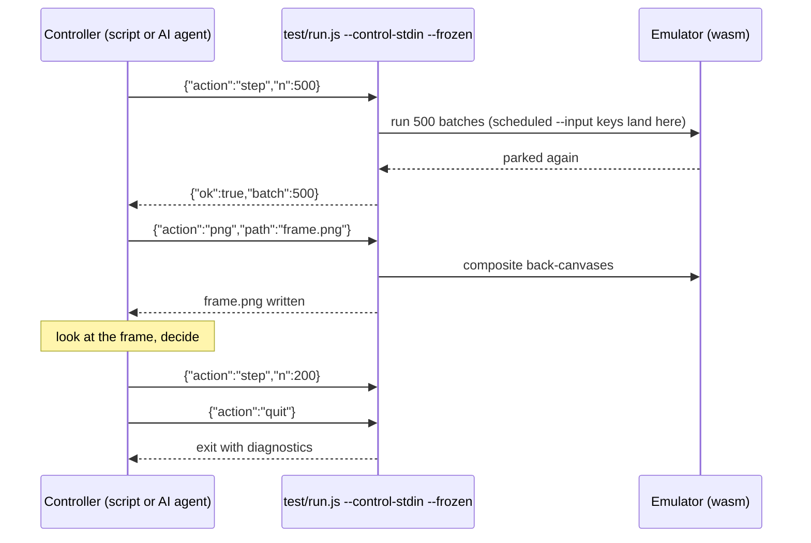

# Driving a Windows 98 emulator from a script: headless runs, frozen mode and the agent control channel
<!-- description: How to drive a Windows 98 emulator from a script: headless runs, batch-scheduled input, frozen mode, a JSON control channel and the browser's agent handoff. -->

Wine-Assembly can be operated entirely from the command line: load a program, advance it by an exact number of steps, inject keys and clicks at chosen points, take screenshots, dump memory, and hand the whole session to another process over a JSON channel. That is how its regression suite works, how AI agents play its games, and how the recordings on the site are made. This article walks through the control surface, from the headless CLI to the browser's "Agent handoff" button.

## Headless first

The emulator's core has no dependency on a browser. `test/run.js` runs the same WebAssembly module under Node with a software raster canvas, and every registered application can be started by id:

```
node test/run.js --app=sol --max-batches=2000 --png=out.png
```

Input is scripted by *batch* number, the unit of the headless run loop: `--input=300:click:120:80,1500:keydown:VK_RETURN` presses things at chosen points in the run, and `BATCH:dump-mem:0xADDR` hexdumps guest memory at that moment rather than at exit, when a buffer has usually been reused. A run can also stop at a guest address, at an API call, or when a memory word changes, and print registers or a stack walk when it does. The whole tracing surface is listed in the repository's `CLAUDE.md`.

Two flags matter for anything time-paced. `--tick-ms-per-batch=N` sets how much guest time one batch represents, because a game that steps on `WM_TIMER` will run out its level timer before a scripted key lands at the default rate. And `--batch-size` is a budget of basic blocks, not a duration, so a video intro that polls the clock retires tiny blocks and looks frozen at a small budget; raising it, not touching the decoder, is the fix.

## Frozen mode and the control channel

`--control-stdin` turns the process into a server that reads newline-delimited JSON commands on stdin. With `--frozen` the emulator parks before its first batch and moves only when told:

```
{"action":"step","n":500}
{"action":"png","path":"frame.png"}
{"action":"snapshot"}
{"action":"quit"}
```



Nothing happens between commands, so a controller can step, look, and decide. A scheduled `--input=` list still runs alongside, so a preamble of keys and clicks can be fixed at launch and the live channel takes over from there; `eval` runs an expression inside the process for anything the fixed commands do not cover. `--max-seconds=N` is the in-process wall-clock guard for these runs, checked between batches, so the process shuts down with its diagnostics instead of being killed from outside.

The design is in [design-agent-control.md](/docs/design-agent-control.md). Its purpose is to let an AI agent be the *player*: given a screenshot and the ability to step, an agent can work through a game's menus, find the state where a bug appears, and hand back a reproducible command line. Several of the reverse-engineering notes in `docs/re-notes/` record command lines that reach a given screen for exactly this reason.

## The same channel in the browser

The browser page exposes the equivalent control through `tools/ctl.js`. The **Agent handoff** button in the debug toolbar copies the current tab's link together with the instructions an agent needs to drive that session, so a person can launch a game, get it to the interesting point, and hand the tab to an agent for the tedious part. The page's frozen mode, the same "nothing moves until told" contract as the CLI, is what makes stepping deterministic in a `setTimeout`-driven run loop.

[design-frozen-recording.md](/docs/design-frozen-recording.md) uses the same mechanism for something else: recordings. A game stepped in frozen mode can be rendered frame by frame at a chosen rate rather than captured from a live screen, so a recording is not at the mercy of whatever else the machine was doing. `tools/record-probe.js` measures what the browser's encoder actually produced (bitrate, keyframe spacing, profile), since every quality setting in `MediaRecorder` is a request the browser may ignore.

## Bringing your own media

The registered applications are the ones the site can distribute. For anything else, the page accepts the user's own files: an executable with its directory, a CD image, or an archive, mounted into the virtual filesystem in the browser and never uploaded. [design-byo-media.md](/docs/design-byo-media.md) covers the container formats and how a program's data files are discovered next to it; [safari-private-browsing.md](/docs/safari-private-browsing.md) covers the storage rules Safari applies that make persisting such a mount harder there than in Chrome. The headless CLI has the same capability through `--exe=` plus `--vfs-include` patterns, so a program that runs from a local disc can be scripted exactly like a registered one.

## Further reading

- [The Win32 API in WebAssembly](/articles/win32-api-in-webassembly.html) for the message loop the injected input flows through.
- [Building an emulator with AI coding agents](/articles/building-an-emulator-with-ai-coding-agents.html) for how the control channel fits the workflow.
- [The story](/story.html), Acts XIV and XV.
