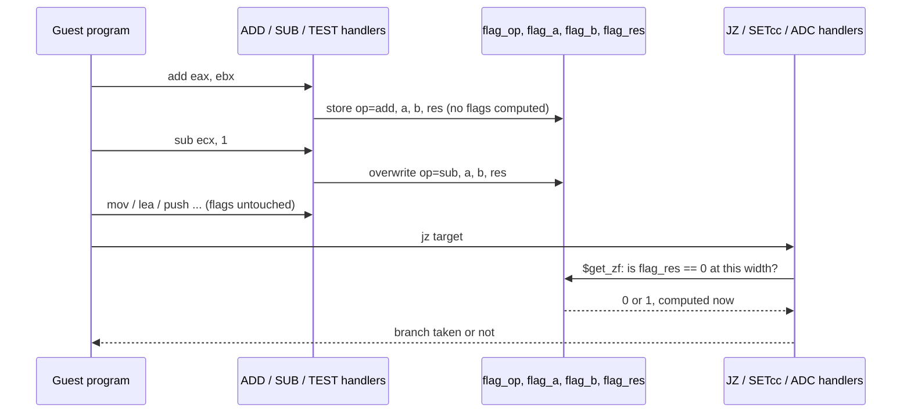

# Lazy flags: how an x86 emulator avoids computing EFLAGS after every instruction
<!-- description: How an x86 emulator skips computing EFLAGS after every instruction: four globals, flags computed on read, the bugs the scheme caused and measured numbers. -->

Almost every x86 arithmetic instruction updates the carry, zero, sign, overflow and parity flags, and almost no instruction reads them. An emulator that computes all five after every `ADD` spends most of its ALU time on results nobody looks at. Wine-Assembly, a Windows 98 emulator written in WebAssembly Text, uses *lazy flags*: it records what the last flag-setting operation was and computes a flag only when a `Jcc`, `SETcc`, `ADC` or `PUSHF` actually asks. This article explains the scheme, the bugs it produced, and what a second implementation in the project's toy VM taught about it.

## The four globals

Instead of a flags register, the interpreter keeps four mutable globals:

| Global | Meaning |
|---|---|
| `flag_op` | which operation last set the flags (add, sub, logic, shift, inc, ...) |
| `flag_a`, `flag_b` | the two operands of that operation |
| `flag_res` | its result |
| `flag_sign_shift` | 31, 15 or 7: where the sign bit is for a 32-, 16- or 8-bit operation |

An `ADD` handler stores its operands and result and moves on. A `JZ` handler calls `$get_zf`, which is `flag_res == 0` masked to the operation width. `$get_cf` for a subtraction is an unsigned compare of the operands; for a shift it is the last bit shifted out, which the shift handler has to stash because it cannot be recovered from the result. `$get_of` needs the sign of both operands and the result, which is why `flag_sign_shift` exists.

The saving is real because flag *reads* cluster: a loop body of ten instructions typically reads flags once, at its branch.

## Where it bit

Lazy flags are a classic source of subtle emulator bugs, and the project's history is a catalogue of them. All of these are in [the story](/story.html), most from the first week:

- **16-bit ALU results not masked.** A 16-bit `SUB` whose `flag_res` still carried the upper 16 bits of the register made `$get_zf` say "not zero" for a result that was zero in the guest's eyes. SkiFree's heap was corrupted by it.
- **INC and DEC preserve CF.** They set every arithmetic flag except carry, so a lazy scheme has to keep the *previous* carry alive across them rather than deriving it from the increment.
- **ADC and SBB.** The carry-in changes both the result and the overflow condition; recording only `flag_a`, `flag_b` and `flag_res` is not enough, since two different carry-ins can produce the same triple.
- **Logic ops and `flag_sign_shift`.** `set_flags_logic` once forgot to record the width. An 8-bit `TEST` was then judged with a 32-bit sign position, and the NSIS installer's `$INSTDIR` string resolution branched the wrong way.
- **Shift CF storage** and **IDIV overflow**, then rotate instructions (`ROL`/`ROR`/`RCL`/`RCR`), which read CF *and* write it.
- **POPFD.** When a program pops a flags word, there is no operation to be lazy about. The interpreter has a "raw flags" mode where `flag_op` says the flags are literal bits in `flag_res`.
- **The parity flag** was added weeks later, when a program was found that reads it. Few do, so it had been silently wrong.

The lesson recorded from these is that every lazy-flag bug looks like something else: a heap corruption, a string that resolves wrong, a game whose logic goes odd. The x86 test-vector suite (`test/test-x86-ops.js`) grew alongside them, and every one of the bugs above is now a pinned case.

## The toy VM's second opinion

In August 2026 the project built a second, much smaller x86 machine, the [toy VM](/articles/dos-emulator-in-webassembly-toy-vm.html), specifically to test interpreter designs on something small enough to rewrite. Lazy flags were one of the designs re-examined there:

- [toyvm-lazy-flags.md](/docs/toyvm-lazy-flags.md) compares eager and lazy evaluation on real DOS programs with the dispatch strategy held constant.
- [toyvm-dead-flags.md](/docs/toyvm-dead-flags.md) goes one step further: a block-local analysis that finds flag *writes* no later instruction in the block can read, and drops the flag bookkeeping for them entirely. Inside a decoded block the reader is known, so the "will anyone read this" question the lazy scheme defers at runtime can often be answered at decode time.

Both docs quote the measured numbers rather than expectations. Read them before concluding that lazy flags are "always faster"; the answer depends on how the interpreter dispatches and how much of the flag state the JIT can keep in registers.

## Further reading

- [How the x86 interpreter is built](/articles/x86-interpreter-in-webassembly-text.html): threaded code, the block cache and dispatch cost.
- The flag helpers live in `src/03-registers.wat`; the ALU handlers that feed them are in `src/05-alu.wat`.
