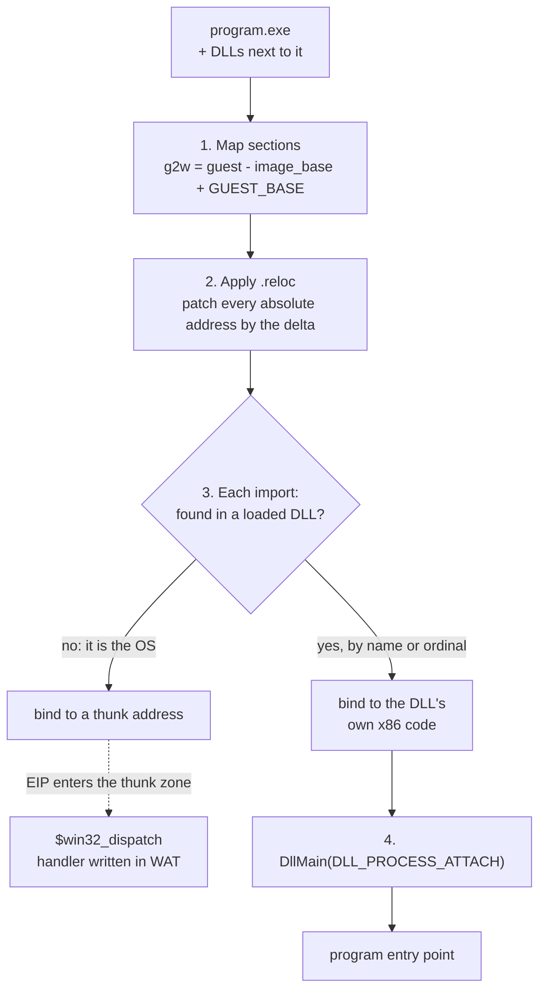

# Loading real Windows DLLs in the browser: MFC42, msvcrt, DirectX and the rest

Wine-Assembly does not reimplement MFC, the Visual C++ runtime or Direct3D Retained Mode. It loads the real `mfc42.dll`, `msvcrt.dll`, `d3drm.dll` and whatever DLLs ship next to a program, relocates them into the emulated address space and runs their x86 code in the same interpreter as the program itself. Only the operating system boundary, the Win32 API, is implemented by the emulator. This article is about the loader that makes that split work.

## Why load DLLs instead of reimplementing them

The decision is the same one Wine made on Linux, applied to a browser: user-mode libraries are just more x86 code, and running the real bytes is both less work and more correct than rewriting them. Paint from Windows NT wants `msvcrt.dll` and `mfc42u.dll`; Diablo brings `storm.dll`, `diabloui.dll` and `smackw32.dll`; the Plus! 98 screensavers use `d3drm.dll` and `d3dxof.dll`, the actual DirectX 6.1 builds. The emulator's job is to load them the way Windows 98 would.

Early on the project shipped stock Win98 copies of `advapi32`, `shell32` and `shlwapi` and loaded those. That was dropped in April 2026: each app now gets the DLLs found next to its own executable, and system DLLs are the emulator's Win32 layer, never a loaded image.

## What the loader does

`src/08-pe-loader.wat` loads the program at its preferred image base, typically `0x400000`, and `src/08b-dll-loader.wat` handles every DLL after it. Per image:

1. **Map the sections** into guest memory. Guest addresses are translated to wasm linear memory by `g2w(guest) = guest - image_base + GUEST_BASE`, so an image at its preferred base costs one subtraction per access.
2. **Apply relocations.** A DLL rarely gets its preferred base once a second one is loaded, so the `.reloc` section is walked and every absolute address is patched by the delta.
3. **Resolve imports.** For each imported function the loader looks first at the DLLs already loaded, matching by name or by ordinal; anything unresolved is assumed to be the operating system and bound to a *thunk address*. When `EIP` enters the thunk zone, `$win32_dispatch` looks the API up and runs its handler in WAT.
4. **Run `DllMain`** with `DLL_PROCESS_ATTACH`, in the guest, before the program's entry point.

Ordinal imports are the awkward case. `mfc42.dll` exports six thousand functions almost entirely by ordinal, and the emulator's own Win32 layer must answer ordinal imports from system DLLs. Two separate tables map ordinals to names, one used by the EXE loader and one by the DLL loader, and forgetting to update both is a mistake the project's memory notes record more than once. `tools/check-data-strings.js` guards the string offsets those tables point at, because inserting one string silently shifts every later one.

## The parts that were not obvious

- **msvcrt's small-block heap.** The Visual C++ 6 runtime probes the OS at startup to decide whether to use its own small-block heap. The emulator patches `__active_heap` at load time so the runtime uses plain `HeapAlloc`, where the emulator's allocator can see every block.
- **COM servers load lazily.** `CoCreateInstance` reads the CLSID's `InprocServer32` key from the virtual registry and loads that DLL. In the browser the file may still be on the network, so the WASM side sets a *yield reason* and returns to JavaScript, which fetches the DLL, and execution resumes when it is mapped.
- **Delay-load imports.** A DLL that resolves an import at first call and cannot find it raises exception `0xC06D007F` and exits. That code, seen in a crash, means a missing export in a loaded DLL rather than a bug in the program.
- **Winamp plugins** are DLLs loaded by the app through `LoadLibrary` at runtime, and `in_mp3.dll` decodes on its own thread. Getting Winamp to play audio meant the loader, the threading model and the wave-out API all had to hold up under a DLL that the program picked at runtime.
- **The `.x` file loader and D3DRM** are the case where being faithful means inheriting a limitation: `d3drm.dll` returns `D3DRMERR_NOTFOUND` for a progressive-mesh sample because that DX6.1 build does not have it, exactly as it would on a 1998 PC.

## Tools that came out of it

Several of the repository's tools exist because the loader needed them: `lib/pe.js` is the one PE header reader every tool shares, `tools/pe-imports.js` dumps an import table, `tools/pe-version.js` reads `VS_VERSION_INFO` to say which DirectX or OLE build a DLL came from, and the `module+0xVA` syntax in the tracing flags translates a disassembly address into the DLL's runtime base without hand arithmetic.

## Further reading

- [The Win32 API in WebAssembly](/articles/win32-api-in-webassembly.html): the other side of the import table.
- [Running 16-bit Windows programs](/articles/running-16-bit-windows-apps-in-webassembly.html): the NE loader, which is a separate machine.
- [The story](/story.html), Acts II and III, for the week MFC first initialised.
