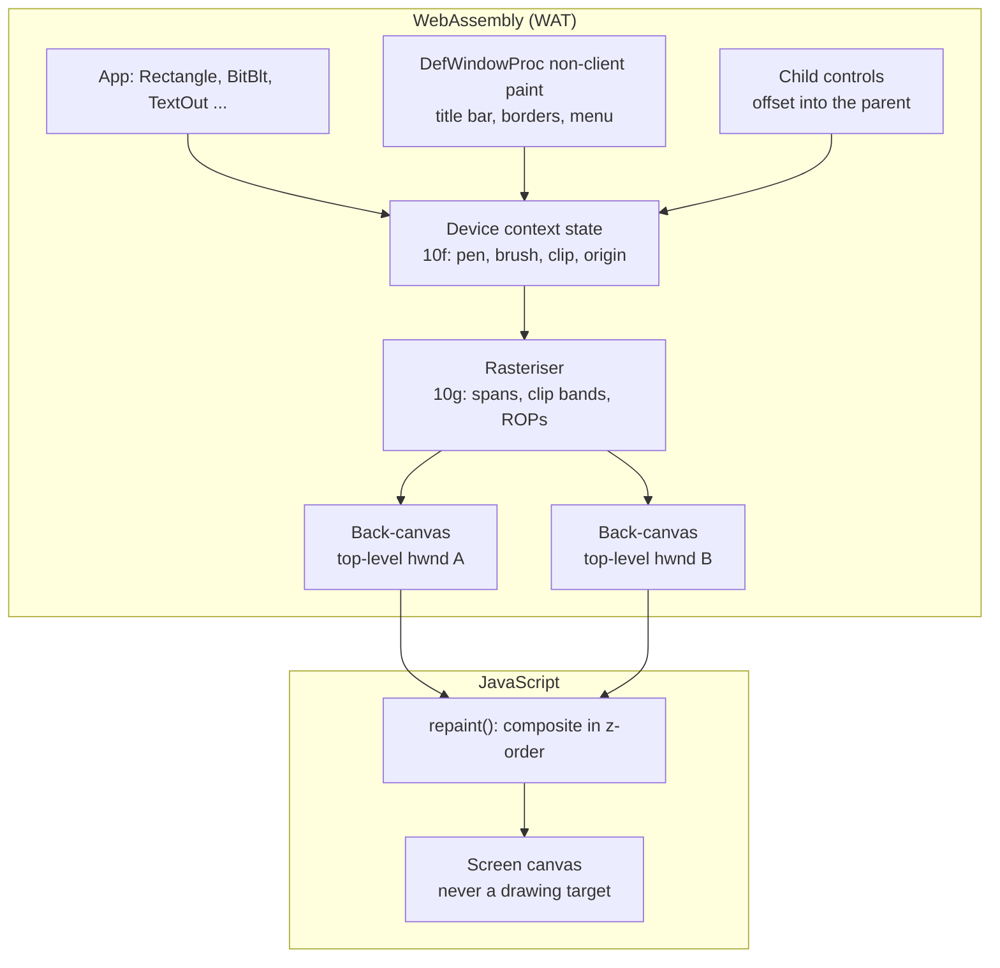

# A software GDI in WebAssembly: rasterising Windows 98 graphics without the browser's canvas

Windows programs draw through GDI: pens, brushes, regions, paths, palettes, bitmap fonts, metafiles and a hundred raster operations. Wine-Assembly started by translating those calls to the HTML canvas 2D API in JavaScript and ended up with a software rasteriser written in WebAssembly Text, with JavaScript reduced to compositing finished windows onto the screen. This article explains why the canvas was not enough, what the WAT rasteriser covers, and how text is drawn.

## Why the canvas 2D API was the wrong target

The first months mapped GDI onto canvas calls: `Rectangle` became `fillRect` plus `strokeRect`, `BitBlt` became `drawImage`, clip regions became `Path2D`. It worked for Notepad and Solitaire and broke down in three ways:

- **Raster ops.** GDI's ternary raster operations (`SRCAND`, `SRCINVERT`, `PATPAINT`, mask blits) are bit-level operations on pixel words. Canvas has blend modes, not ROPs, and games use ROPs for sprite masking.
- **Pixel ownership.** A program that calls `GetPixel`, locks a DIB section and reads what it drew, or blits from the screen expects the bytes it wrote. Round-tripping through `getImageData` was slow and lossy through premultiplied alpha.
- **Consistency.** `TextOut` in Chrome and in Safari measured differently, so dialogs laid out differently by browser, and a headless test could not agree with either.

The [software GDI design](/docs/software-gdi-design.md) set the goal: every GDI call rasterises into a DIB in wasm memory, and the host's only job is to put finished pixels on screen. The [migration status](/docs/gdi-migration-status.md) tracked each primitive as it moved.

## What lives in WAT now

The GDI code is seven source parts, `src/10a` to `src/10g`:

- **Bitmaps** (`10a`): a 48-byte object record per bitmap, raw DIB parsing for 1/4/8/24/32 bpp, and who owns the canonical bits.
- **Regions and paths** (`10d`): a region allocator, a polygon scan-converter, and a path engine that records, flattens, widens and strokes, so `BeginPath`/`StrokePath` and `SetWindowRgn` for skinned windows like Winamp's are real.
- **Metafiles and palettes** (`10e`): a WMF/EMF recorder and player, and logical palettes for 8bpp surfaces.
- **Device contexts** (`10f`): save/restore, selected objects, mapping modes and viewport origins as real per-DC state, text metrics, and the entry points the host calls.
- **The rasteriser** (`10g`): span fill, clip bands, brush sampling (solid, hatched, pattern), lines, ellipses, arcs and polygons, region combining, and the blit family with ROPs.

Clipping is band-based: a DC's clip region is intersected with the surface bounds and the window's visible region into horizontal spans, and every primitive walks those spans. A fast path that skipped the surface-bounds intersection was one of the recorded bugs; the rule from it is that a clip must always intersect the surface, however simple the region.

## One surface per top-level window

Every top-level `HWND` owns one offscreen back-canvas the size of the whole window, allocated lazily. All GDI output for that window and its children lands there, with child coordinates offset into the parent's surface, and non-client painting (title bar, borders, menu bar) draws into the same surface from `DefWindowProc` in WAT. `repaint()` in JavaScript composites the back-canvases in z-order onto the screen canvas. The screen is never a drawing target.

This is the rule the project keeps repeating in its own docs: **do not add a second drawing surface.** Every time one appeared (a JS overlay for menus, a per-control canvas) a ghost or a stale rectangle followed, because two surfaces disagree about who erased what. The `--trace-ctrl` and `--trace-dc` flags exist to answer "who drew these pixels and onto what".

## Text

Windows 98 text is bitmap fonts first. `src/10b-gdi-font.wat` parses `.FNT` strikes (the format inside `.FON` files) and rasterises glyphs in WAT, with a font registry the `CreateFont` matcher searches; the bundled W95FA and Fixedsys Excelsior faces give the period look. TrueType is handled in two layers: `10c` parses `glyf` outlines with bounds checks for advance widths and `TEXTMETRIC`, so layout is identical everywhere, and `10c1` is a runtime TrueType instruction engine (`fpgm`, `prep` and glyph programs over eight ppem contexts) so hinted small sizes render as they did on a 1998 screen. The [scalable font design](/docs/scalable-font-design.md) and [runtime hinting design](/docs/runtime-truetype-hinting-design.md) cover both.

Dialog units, which every dialog template is laid out in, come from the system font's average character size; `font-metrics.json` in the repository is the measured ground truth those calculations are checked against.

## Performance notes

Moving rasterisation into WAT made it measurable. `SetDIBitsToDevice`, the hot path for every game that draws into a DIB and blits it, got an 85x fast path in April 2026; later work on the `DIB` arena found a printer DC quietly consuming it, and `gdi_dib_arena_stat` now tells exhaustion from fragmentation. The one thing the docs warn against is measuring GDI by intercepting calls: a wrapped `BitBlt` counts nothing useful, and the honest measurement is reading pixels off the parent surface.

## Further reading

- [The Win32 API in WebAssembly](/articles/win32-api-in-webassembly.html) for the window layer above GDI.
- [DirectDraw](/articles/directdraw-direct3d-in-the-browser.html), whose surfaces share DCs with GDI.
- [The story](/story.html), Act IV and Act XII, for the two migrations.
