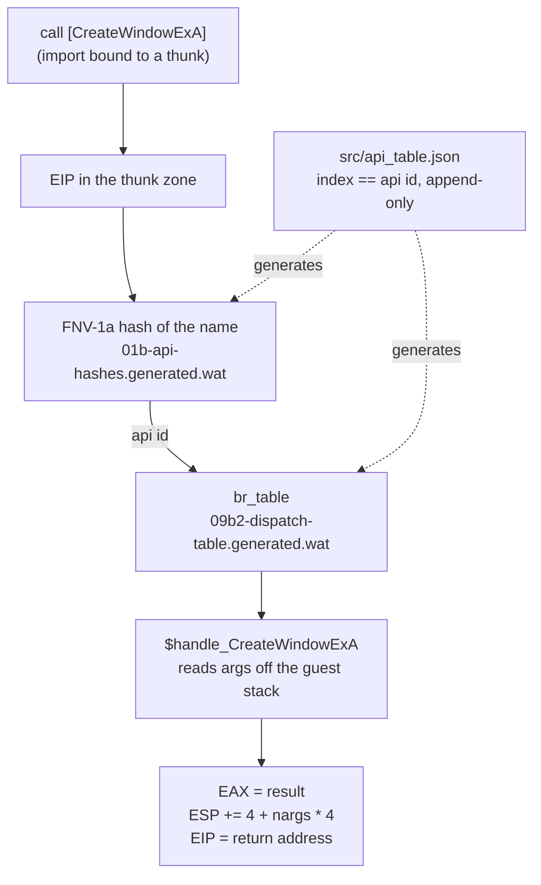
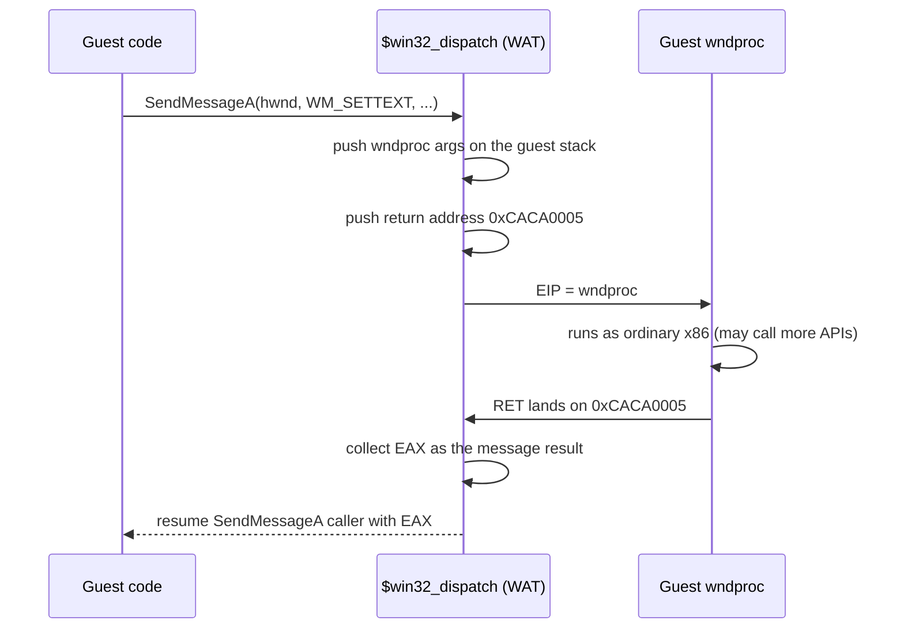

# Implementing the Win32 API in WebAssembly: 3,000 functions, one dispatch table

A Windows program is mostly calls into the operating system: create a window, get a message, draw text, open a file. Wine-Assembly answers those calls with handlers written in WebAssembly Text, about 3,300 of them, chosen one crash at a time by running real Windows 98 software until it asked for something missing. This article is about how that API layer is structured, how a call gets from the program to a handler, and the two rules that kept it honest.

## From import to handler

When the [loader](/articles/loading-real-windows-dlls-in-the-browser.html) cannot find an imported function in a loaded DLL, it binds the import to an address in a reserved *thunk zone*. The program calls it like any other function. When the interpreter sees `EIP` land in that zone, `$win32_dispatch` takes over:

1. The API's identity is looked up by name through a generated FNV-1a hash table (`src/01b-api-hashes.generated.wat`), which maps a name to a small integer id.
2. A generated `br_table` (`src/09b2-dispatch-table.generated.wat`) jumps on that id to the handler function, `$handle_CreateWindowExA` and so on.
3. The handler reads its arguments off the guest stack, does the work, writes `EAX`, and pops the arguments the way a `stdcall` callee would.

The whole table is driven by one JSON file, `src/api_table.json`. Its array index *is* the API id, baked into the compiled hash table, so the file is append-only and a build gate rejects a mid-array insert. Each entry can also carry typed argument descriptions, which is what lets the `--trace-api` flag print `CreateWindowExA(class="Edit", style=WS_CHILD|WS_VISIBLE, ...)` with decoded flags, and decode out-parameters after the handler ran.

COM interfaces use the same machinery. A DirectDraw or Direct3D vtable is a block of thunk addresses whose ids are computed from the interface prefix (`IDirectDrawSurface_*`), so adding a method never requires renumbering.

## Calls that call back

The hard part of a Win32 layer is not the function count but the calls that re-enter the program. `SendMessage` must run the window procedure synchronously and return its result; `DialogBox` must pump messages until the dialog closes; `CreateWindow` must deliver `WM_CREATE` before it returns.

The emulator does these with *continuation thunks*. `SendMessageA` pushes the wndproc's arguments on the guest stack, sets `EIP` to the wndproc, and pushes a return address in a reserved range (`0xCACA0005`). When the wndproc's `RET` lands there, the dispatcher recognises the address, collects `EAX` as the message result and resumes the original `SendMessage` caller. Modal dialogs and message boxes use the same trick with a small message pump inside the thunk. `UpdateWindow` finishes the paint before it returns for the same reason real Windows does: Taipei draws its splash screen on the line after it, and a deferred erase would cover it.

`GetMessage` itself is a priority sequence rather than a single queue: quit, pending child `WM_CREATE`/`WM_SIZE`, the posted-message ring, startup activation messages, host input, paint, timers, and finally `WM_NULL` for idle.

## Windows, controls and menus live in WAT

The first weeks kept window chrome, menus and control state in the JavaScript renderer. In April 2026 that was reversed into a rule the project still follows: **JavaScript is GDI primitives only; everything else is WAT.** Window records, class tables, `GWL_*` slots, focus, the built-in `Button`/`Edit`/`ListBox`/`ComboBox`/`TreeView`/`ListView` window procedures, `DefWindowProc`'s non-client painting, menu layout and hit-testing, dialog templates and the common dialogs are all in `src/09c*.wat`. Even that boundary later moved: GDI rasterisation itself went into WAT ([software GDI](/articles/software-gdi-in-webassembly.html)), and JavaScript is now the compositor and the input source.

The reason is consistency. A control implemented as a real window with an `HWND`, a class and a wndproc behaves like one under every API that touches windows, including the odd ones (`EnumChildWindows`, `GetWindowLong` on a control, subclassing). The [controls-as-windows plan](/docs/controls-as-windows-plan.md) records the migration step by step.

## Two rules

**No silent stubs.** An unimplemented API traps with `unreachable` through `$crash_unimplemented`, and the crash log names the API. A stub that returns 0 hides the gap and surfaces it later as corruption somewhere unrelated, which is a much more expensive session. The project converted its early silent stubs to traps within a week of starting and has a build gate against writing new ones. The gate also checks that every handler pops its arguments, since a wrong `ESP` adjustment is the other classic way a stub looks fine and breaks the next call.

**Trace flags, not `console.log`.** Every question of the form "what did the program ask for" has a runtime flag: `--trace-api`, `--trace-gdi`, `--trace-fs`, `--trace-reg`, `--trace-input`, `--trace-ctrl`. Source stays clean between sessions and the flag is there for the next one.

## Where the count stands

The API table holds about 3,300 entries across `kernel32`, `user32`, `gdi32`, `advapi32`, `shell32`, `comctl32`, `comdlg32`, `winmm`, `ole32`, `ddraw`, `d3d`, `dsound`, `dinput`, `wsock32`, `tapi32` and `opengl32`, plus the Win16 `KERNEL`/`USER`/`GDI` ordinals, which have their own Pascal-convention dispatcher. The number grows only when a program needs it: the project runs about 180 registered applications and games, and each one's [reverse-engineering note](/docs/re-notes/) records what it asked for.

## Further reading

- [The story](/story.html), Acts III and IV, for the platform week and the "logic into WAT" decision.
- [DirectDraw and Direct3D](/articles/directdraw-direct3d-in-the-browser.html): the COM part of the API.
