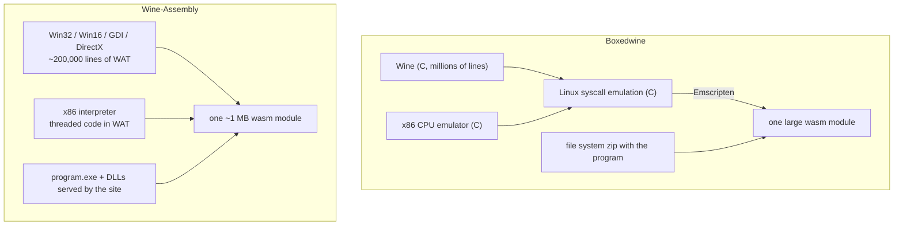

# Wine-Assembly vs Boxedwine: two ways to run Windows programs in the browser without Windows
<!-- description: Boxedwine compiles Wine and a CPU emulator to WebAssembly; Wine-Assembly writes the Win32 layer and the x86 interpreter in WebAssembly Text from scratch. -->

[Boxedwine](https://github.com/danoon2/Boxedwine) and Wine-Assembly share an idea: run a Windows program in a browser by providing the Windows API rather than by booting Windows. They diverge on where that API comes from. Boxedwine takes Wine, the Linux project that has implemented Win32 for decades, and compiles it together with a Linux-emulation layer and an x86 CPU emulator to WebAssembly. Wine-Assembly writes both the CPU interpreter and the Windows layer directly in WebAssembly Text, with no C in the pipeline, and implements APIs as real programs ask for them. This page is written from the Wine-Assembly side; Boxedwine's own documentation is the reference for its details.

## Where the Windows API comes from

**Boxedwine** gets Wine's breadth: the Win32 surface Wine covers is much larger than anything a new project can build, and it comes with Wine's testing history. It pays for that with size and indirection. The program's calls go through Wine's implementation, which goes through emulated Linux system calls, which go through a CPU emulator, all compiled from C. A Boxedwine deployment ships a file system as a zip containing the program and the Wine pieces it needs.

**Wine-Assembly** has a much smaller API surface, about 3,300 functions across `kernel32`, `user32`, `gdi32`, `ddraw`, `d3d`, `dsound`, `winmm`, `ole32`, the Win16 modules and others, each added because a real program needed it. In exchange there are no layers between the program and the implementation: a `CreateWindowExA` is a WAT function reading arguments off the guest stack, window records and controls are WAT tables, and the GDI rasteriser draws into wasm memory that the host only composites. The whole emulator is one module of about a megabyte, and a program starts when its executable has been fetched.

## Side by side

| | Boxedwine | Wine-Assembly |
|---|---|---|
| Windows API | Wine, compiled from C | Written in WebAssembly Text, program by program |
| CPU | A C x86 emulator compiled with Emscripten | A threaded-code interpreter in WAT, with loop super-ops |
| Runtime layers | program, Wine, Linux emulation, CPU emulator | program, emulator |
| Download | The wasm module plus a file system zip per program | One wasm module plus the program's own files |
| API coverage | Wine's, very broad | Narrower; a missing function is a named crash, not a silent stub |
| 16-bit programs | Through Wine's Win16 support | A separate NE loader and Win16 dispatcher in WAT |
| DirectX | Wine's DirectX-on-OpenGL, as far as the CPU emulator allows | DirectDraw, Direct3D 5-7 immediate mode, Direct3D 9 and OpenGL 1.x frontends in WAT |
| Debuggability | Wine's debug channels | Per-category trace flags, a headless CLI, a JSON control channel |
| Best for | Running a wide range of software with minimal per-program work | Shipping a curated set of programs that open instantly, and understanding exactly what each one does |

## Why write it instead of compiling Wine

The reason is not that Wine is bad; it is that the two projects have different goals. Wine-Assembly's goal was to find out whether an emulator of this size could be written directly in WebAssembly Text, with AI coding agents doing most of the writing, and to have every layer be inspectable: what a program asked for, what the emulator answered, which pixels were drawn by whom. The [project story](/story.html) records how that went. A compiled Wine gives you a working program much sooner and tells you much less about it.

The practical consequence for a visitor is the failure mode. When a program hits a function Wine-Assembly has not implemented, it stops and names the function, and that name is the next thing to implement. Boxedwine running Wine has a far smaller chance of hitting a missing function, and a far larger stack to look through when something goes wrong inside it.

## Further reading

- [The Win32 API in WebAssembly](/articles/win32-api-in-webassembly.html), how the handlers are dispatched and why there are no silent stubs
- [Loading real Windows DLLs](/articles/loading-real-windows-dlls-in-the-browser.html), the one place both projects agree: user-mode DLLs are loaded, not rewritten
- [Wine-Assembly vs v86](/articles/wine-assembly-vs-v86.html), the whole-PC alternative
- [Wine-Assembly vs DOSBox](/articles/wine-assembly-vs-dosbox.html)
