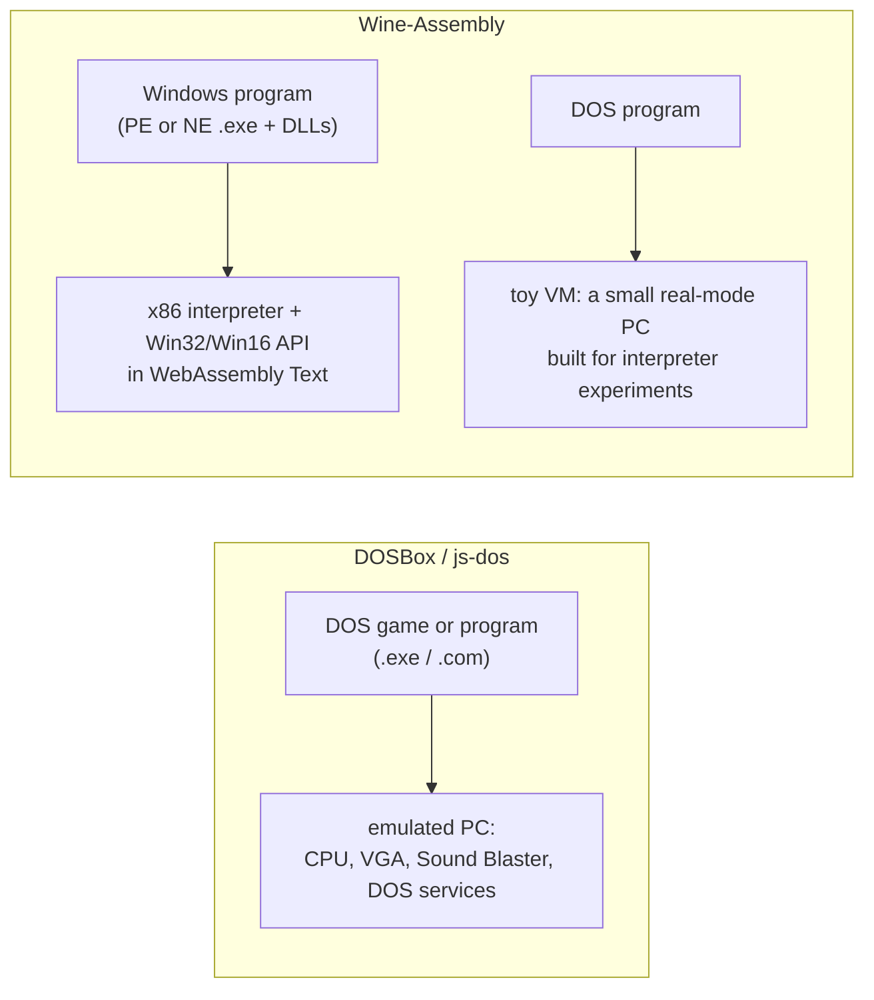

# Wine-Assembly vs DOSBox and js-dos: Windows 98 programs, not DOS programs, in the browser
<!-- description: DOSBox and js-dos run DOS software in the browser; Wine-Assembly runs Windows 98 and Windows 3.x programs with no operating system. Where the two overlap. -->

People arrive at Wine-Assembly looking for "DOSBox in the browser", so it is worth being clear: it is not that. [DOSBox](https://www.dosbox.com/) emulates a DOS-era PC, and [js-dos](https://js-dos.com/) and the Emscripten ports put that in a browser tab. Wine-Assembly runs *Windows* programs, 32-bit Win32 and 16-bit Windows 3.x, and does it without any operating system, by implementing the Windows API in WebAssembly Text. The two overlap on one thing, the x86 interpreter, and on one small project inside this one. This page is written from the Wine-Assembly side; the DOSBox and js-dos sites are the reference for theirs.

## What each one runs

**DOSBox** runs DOS software: real-mode and protected-mode programs that talk to DOS, the BIOS, VGA registers and a Sound Blaster. It is the standard way to play a DOS game, and js-dos makes a DOS game embeddable on a web page with a `.jsdos` bundle. Running Windows 9x *inside* DOSBox is possible with forks like DOSBox-X, but it means installing Windows into the emulator and booting it, which is a different undertaking from playing a game.

**Wine-Assembly** runs Windows programs directly. A PE executable is loaded at its image base with its DLLs, its imports are bound to Win32 handlers in the emulator, and it starts. A 16-bit NE executable goes through a separate loader and a Pascal-convention Win16 dispatcher. There is no Windows to boot and no disk image to supply; the [apps list](/apps/) is what the site serves, and you can also mount your own program's folder.

The one overlap is that Wine-Assembly contains a small real-mode DOS machine, the [toy VM](/articles/dos-emulator-in-webassembly-toy-vm.html). It runs a corpus of 199 DOS programs and demos with VGA and Sound Blaster, OPL2 and GUS audio, and uses DOSBox as its ground truth for timing and sound. It exists to test interpreter designs on a machine small enough to rewrite, not to replace DOSBox.

## Side by side

| | DOSBox / js-dos | Wine-Assembly |
|---|---|---|
| Target | DOS programs | Windows 98 (Win32) and Windows 3.x (Win16) programs |
| Operating system | DOS services emulated inside DOSBox | None; the Windows API is implemented by the emulator |
| Hardware emulated | CPU, VGA, sound cards, keyboard, mouse, joystick | The CPU only; Windows APIs stand in for the devices |
| Windows 9x games | Only by installing Windows inside a fork such as DOSBox-X | Directly, when the game's APIs are implemented |
| DirectX | Not applicable | DirectDraw, Direct3D 5-7 and 9, DirectSound, DirectInput |
| In the browser | js-dos and Emscripten builds, C++ compiled to wasm | Written in WebAssembly Text; one module of about a megabyte |
| CPU | A dynamic recompiler on native builds, an interpreter in the browser | A threaded-code interpreter with loop super-ops |
| Best for | Any DOS game | Windows-era games and applications that should open from a link |

## Which one you want

If the program is a DOS program, you want DOSBox or js-dos, and Wine-Assembly's toy VM is not a substitute for playing it. If the program is a Windows executable, DOSBox cannot run it without a Windows installation inside it, and Wine-Assembly runs it, or crashes with the name of the API it lacks. Programs from the Windows 98 CD, the Entertainment Packs, Plus! 98, and the freeware and shareware of that era are the Wine-Assembly corpus; the [reverse-engineering notes](/docs/re-notes/) say how far each one goes.

## Further reading

- [Running 16-bit Windows 3.x programs](/articles/running-16-bit-windows-apps-in-webassembly.html), the NE loader
- [DirectDraw and Direct3D in the browser](/articles/directdraw-direct3d-in-the-browser.html)
- [A DOS emulator built to answer interpreter-design questions](/articles/dos-emulator-in-webassembly-toy-vm.html), the toy VM and what it borrows from DOSBox
- [Wine-Assembly vs v86](/articles/wine-assembly-vs-v86.html) and [vs Boxedwine](/articles/wine-assembly-vs-boxedwine.html)
