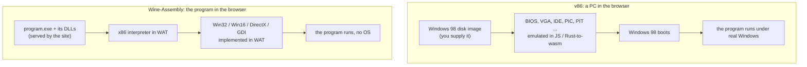

# Wine-Assembly vs v86: running Windows 98 software in the browser without booting Windows 98
<!-- description: v86 emulates a whole PC and boots a Windows 98 disk image; Wine-Assembly runs the program directly on a Win32 layer in WebAssembly. What each needs and runs. -->

Both projects put 1990s Windows software in a browser tab, and they do it in opposite ways. [v86](https://copy.sh/v86/) is a PC emulator: it boots an operating system image and the program runs inside that. Wine-Assembly is an API-level emulator: there is no Windows underneath, the program's x86 code is interpreted directly and every call it makes into Windows is answered by a Win32 implementation written in WebAssembly Text. This page is about what that difference means in practice. It is written by the Wine-Assembly side, so read the v86 half as a fair summary rather than an authority; v86's own documentation is the reference for it.

## The two approaches

**v86** emulates the machine: CPU, memory, BIOS, VGA, disk controllers, timers, keyboard and mouse. Anything that ran on such a PC can in principle run, because the real operating system is doing the real work. The cost is that you need that operating system: a disk image of Windows 98, or FreeDOS, or Linux, which you install or obtain yourself, and which boots before your program does.

**Wine-Assembly** emulates the program's view of Windows, the way [Wine](https://www.winehq.org/) does on Linux. The executable is loaded at its preferred base, its DLLs are loaded beside it, and its imports of `user32`, `gdi32`, `ddraw` and the rest are bound to handlers in the emulator. The program starts in the time it takes to fetch it, and the site can ship the freeware and shareware it is allowed to. The cost is that every Windows API a program needs has to have been implemented, one crash at a time; about 3,300 have been.

## Side by side

| | v86 | Wine-Assembly |
|---|---|---|
| What is emulated | A whole IBM PC | The Windows API and the x86 CPU |
| What you need | An OS disk image (Windows 98, DOS, Linux...) | The program's executable and data files |
| Time to the program | The OS boots first | Seconds: the exe loads and runs |
| What runs | Anything that ran on the emulated PC, subject to speed | Win32, Win16 and DirectX programs whose API surface is implemented |
| Fidelity | The real OS, drivers and all | The program's own code is real; Windows is reimplemented |
| Sound, network | Emulated devices, driven by the OS's drivers | Emulated Windows APIs (waveOut, DirectSound, Winsock over a virtual LAN) |
| Implementation | JavaScript with a Rust core compiled to WebAssembly | WebAssembly Text throughout, with a JavaScript compositor and host |
| Where the work goes | Device accuracy and CPU speed | API coverage, one program at a time |
| Licensing of what you run | Your own images | The site serves what it may redistribute; you can mount your own files |

## When to use which

Use **v86** when the point is the machine: an old operating system to explore, a program that talks to hardware or drivers directly, or software with an install procedure that expects a real Windows. It is also the honest reference for "what would real Windows 98 have done": Wine-Assembly's own reverse-engineering notes use a v86 session as the native-behaviour baseline when the emulator and a program disagree.

Use **Wine-Assembly** when the point is the program: a game or an application that should open from a link in a few seconds, on a phone as well as a desktop, with nothing to install and nothing to boot. The desktop on the front page is a list of such programs, from Notepad and Solitaire to Pinball, Winamp, DX-Ball and the Heroes of Might and Magic II demo, and each has its [own page](/apps/).

## What Wine-Assembly does not do

It does not run a program whose API needs have not been implemented; that program crashes with the name of the missing function, by design, rather than limping on. It does not emulate hardware, so a driver-level program has nothing to talk to. And it is an interpreter, not a JIT, so a heavy 3D game runs slower than it would under a native-code CPU emulator; the [interpreter design article](/articles/x86-interpreter-in-webassembly-text.html) has the measurements.

## Further reading

- [How the x86 interpreter is built](/articles/x86-interpreter-in-webassembly-text.html)
- [The Win32 API in WebAssembly](/articles/win32-api-in-webassembly.html), the layer that replaces the operating system
- [Wine-Assembly vs Boxedwine](/articles/wine-assembly-vs-boxedwine.html), the closer comparison: Wine itself compiled to WebAssembly
- [Wine-Assembly vs DOSBox](/articles/wine-assembly-vs-dosbox.html)
