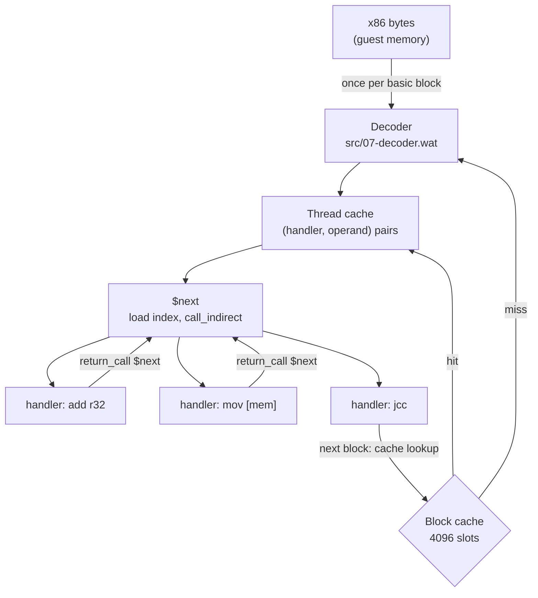
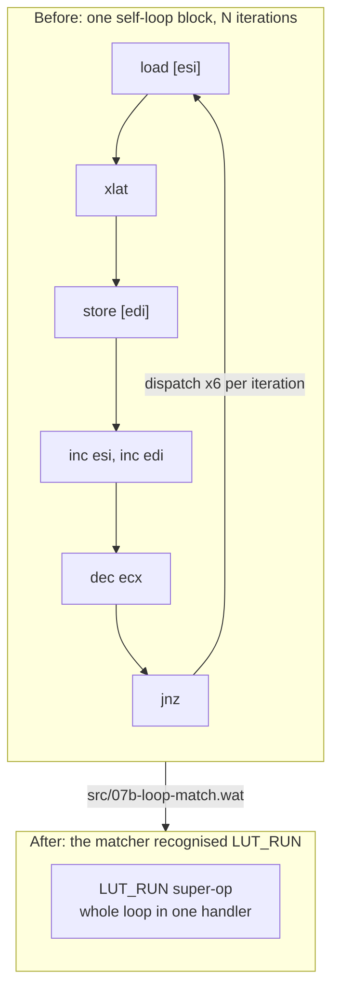

# How to write an x86 interpreter in raw WebAssembly Text

Wine-Assembly runs Windows 98 programs in the browser on an x86 interpreter written directly in WebAssembly Text (WAT), with no C, Rust or AssemblyScript in front of it. This is how that interpreter is put together: a decoder that turns x86 into threaded code, an indirect-call dispatcher, a block cache, and the measurements that decided which optimisations were worth keeping. It is the technical core of [the project story](/story.html).

## Threaded code, not a giant switch

Most interpreters written in a systems language are a `switch` over opcodes inside a loop. WAT has no `switch` and no computed goto, but it does have `call_indirect` through a function table, and that is enough for **Forth-style threaded code**.

The decoder in `src/07-decoder.wat` reads x86 bytes once per basic block and emits a sequence of `(handler index, operand)` pairs into a *thread cache*. Every x86 instruction form has a small WAT function, a *handler*, that does its work and then calls `$next`. `$next` advances the thread pointer, loads the next handler index and jumps to it through the handler table (`src/02-thread-table.wat`, several hundred entries). A basic block is therefore executed as a chain of indirect calls, and the x86 bytes are never looked at again until the block is evicted.

Two consequences shape everything else:

- **Decoding is amortised.** A tight game loop is decoded once and then runs as threaded code. The decoder can afford to be careful, since it does not sit on the hot path.
- **Registers live in wasm globals.** EAX..EDI, EIP, the flag state and the segment bases are `(global (mut i32))`, which the JIT keeps in machine registers across a handler. Memory operands go through `$g2w`, the guest-to-wasm address translation.

## The block cache

Each decoded block is found again by hashing its guest address: the slot index is `(ga ^ ga>>12) & CACHE_MASK`, over 4096 slots, and the threaded code itself lives in a 30 MB arena carved into eight per-thread partitions so guest threads never invalidate each other's code. `tools/cache-slots.js` replays a real working set through that hash to decide whether a miss storm is a size problem or an aliasing problem. On Caesar III the working set was 1,861 blocks in 4,096 slots and no alternative hash did better, which settled that its re-decodes were not a cache-size problem.

Execution is metered in blocks: the host's `run(N)` spends one budget unit per block, and a block gets a quantum of 1,000 threaded ops. A block is not a fixed amount of work. Measured on Diablo, its Smacker intro retires about 7 ops per block while its menu retires 282, a 41x spread inside one program, which is why the project quotes ops or wall time and never "batches per second".

## What a dispatch costs

Because the whole machine is indirect calls, dispatch cost is the number that matters. The project measured it rather than guessing:

- **Tail calls** (`return_call_indirect`) for the handler chain made execution about 40% faster the day they landed in April 2026. Without them every handler's call to `$next` grew the wasm stack.
- `tools/bench-loops.js` injects hand-encoded x86 into a live instance and times A/B arms in one process with the order rotated, giving a ±1% noise floor. It priced **a dispatch at about 8 ns and a block transfer at about 9 ns on top**.
- `tools/wasm-native.js` shows the machine code SpiderMonkey makes of one function. `$next` compiles to 193 instructions and opens every dispatch with a frame setup, a stack-limit check and an interrupt check.
- `tools/inline-verdicts.js` reads V8's inlining trace weighted by call count. The engine refuses to inline `$next` at the sites carrying millions of calls, which is where the remaining dispatch overhead lives.

## Folding loops into super-ops

Since dispatch is the cost, the obvious lever is fewer dispatches. `src/07b-loop-match.wat` looks at every self-loop block the decoder emits, classifies its ops into roles (induction variables, memory streams, side effects) and, when a known idiom holds, replaces the whole body with one super-op that runs the loop inside a single handler. `REP MOVS`/`STOS` were the first case, lowered to `memory.copy` and `memory.fill`. Table-lookup runs (`LUT_RUN`) are on by default; a run-length sprite blit fold for Caesar III bought about 7%, a rectangle-fill fold about 12%.

The design doc, [loop-idiom-superops-design.md](/docs/loop-idiom-superops-design.md), records the matcher's decline histogram across ten games: only about 2% of static self-loops match, and calls and multi-branch bodies are most of the declines. The lesson recorded there is to **fold memory traffic, not control flow**: a fold that removed a jump chain but kept every dispatch measured at roughly zero.

## The nulls are written down too

Several ideas that sound obviously good were measured and found to be nothing, and the docs keep them so they are not retried:

- Compiling whole pages ahead of time halved decode counts and came out dead even at every V8 tier ([page-compile-design.md](/docs/page-compile-design.md)).
- Inlining `$next`'s source into every handler removed dispatches and did not get faster ([next-source-inline.md](/docs/next-source-inline.md)).
- Splitting accessors into a fast path and a cold tier did change what V8 inlines, but the ~8% that inlining budget is worth turned out to be a dispatch and register problem, not a memory-translation one ([accessor-fastpath-split.md](/docs/accessor-fastpath-split.md)).

A separate, smaller machine, the [toy VM](/articles/dos-emulator-in-webassembly-toy-vm.html), exists partly so that dispatch designs can be compared on a machine small enough to rewrite in a day. Its shootout of dispatch strategies is in [toyvm-dispatch-shootout.md](/docs/toyvm-dispatch-shootout.md), and its region JIT is the next step the main emulator is measuring ([repl-tailcall-main-emu.md](/docs/repl-tailcall-main-emu.md)).

## Further reading

- [interpreter-dispatch-perf.md](/docs/interpreter-dispatch-perf.md): the whole-app measurement ledger and why single-process A/B on a loaded machine is unresolvable.
- [wasm-stack-threaded-code.md](/docs/wasm-stack-threaded-code.md): keeping the guest's stack on the wasm value stack.
- [Lazy flags](/articles/lazy-flags-x86-emulator.html): the other half of making an x86 interpreter fast.
- [The story](/story.html), Act I, for the three days in which the decoder went from nothing to running Notepad.
