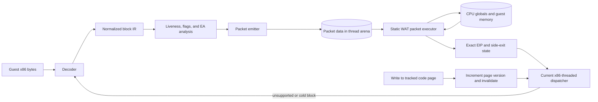

# WAT-Threaded Packet Backend Design

Status: generic stack executor and packet assembler implemented; decoder
integration is still an AoE benchmark fixture and remains disabled by default.

Related design: [Direct x86-to-Wasm Compiler](x86-to-wasm-compiler.md)

## ASCII TL;DR

```text
                                      WAT-THREADED PACKET TIER

  guest x86 bytes        shared compiler front end                     static runtime module
 +----------------+     +---------------------------+     +----------------------------------------+
 | decode at EIP  | --> | normalized IR             | --> | emit compact packet DATA               |
 | record pages   |     | liveness + flags + EA     |     | [header][op][args][op][args]...[exit] |
 +----------------+     +---------------------------+     +-------------------+--------------------+
                                                                                 |
                                                                                 v
 guest state              one Wasm invocation                        +----------------------------+
 +----------------+     +----------------------------------------+   | static WAT packet executor |
 | live-in globals| --> | locals: virtual regs / flags / EA / TOS|<--| read op -> dispatch -> loop |
 | memory + EIP   |<--  | flush dirty live-outs, set exact EIP   |   +----------------------------+
 +-------+--------+     +------------------+---------------------+
         ^                                     |
         | page write / unsupported op /       | normal exit or side exit
         | debug / yield / guard failure        v
         +----------------------------- current x86-threaded dispatcher

  FAST INSTALL, NO NEW WASM MODULE              COST LEFT: PACKET DISPATCH + GENERIC STATE SYNC
```

## Mermaid Overview



## Summary

The WAT-threaded backend is an intermediate execution tier between the current
x86 threaded interpreter and direct x86-to-Wasm compilation:

```text
x86 bytes
  -> normalized block IR
  -> liveness and flag analysis
  -> compact packet data
  -> one static WAT packet executor
  -> normal interpreter exit
```

The name is easy to misread. Runtime code generation does **not** emit WAT.
The packet is data, and a static executor written in WAT interprets that data.
"WAT-threaded" is shorthand for "packet-threaded execution inside a WAT
handler."

This tier is worth building because it can:

- cross several current x86-handler boundaries in one Wasm invocation;
- hold guest registers and virtual flags in Wasm locals;
- coalesce repeated writes to the same guest register;
- evaluate a compare and branch without materializing dead flags;
- reuse effective-address calculations within a block or short trace; and
- install a packet immediately without asking the browser to compile a new
  Wasm module.

It will not match a direct compiler on the best hot paths. Packet opcode
dispatch and generic state synchronization remain in the hot loop. Its value is
lower implementation cost, immediate installation, broad coverage, and a
fallback tier for code that is too mutable or too cold for direct compilation.

## Current Evidence

### Generic Implementation Snapshot

The branch now contains an application-neutral stack packet VM in
`src/05-alu.wat` and a compiler-side assembler/verifier in
`tools/wat-stack-packet.js`. The executor knows only x86 architectural register
IDs, stack operations, integer/memory operations, flags, and control flow. It
does not contain AoE addresses or blitter algorithms.

The initial vocabulary is:

```text
PUSH_REG / POP_REG / PUSH_I32
LOAD8_U / LOAD32 / STORE32
ADD / ADD_FLAGS / SUB / SUB_FLAGS / AND_FLAGS
SHL / SHR_U_FLAGS
JMP / JCC / CMP_JCC
CMP_RM32_JCC reg,[base+disp],cc,target,fall
```

The decoder currently hand-emits packets for four AoE addresses solely as a
repeatable fixture. Replacing that fixture with normalized-IR emission is the
next compiler step.

Stack underflow, maximum depth, register IDs, condition codes, immediates, and
terminal control flow are checked once by the assembler. The WAT hot loop does
not repeat stack-depth or operand-validity checks. Packets are trusted compiler
output, just as a generated Wasm function is trusted after validation.

Differential coverage executes x86-threaded, the original narrow packet, the
generic stack packet, and the hand-optimized block from identical state and
compares registers, flags, memory, and EIP.

### Generic Stack Benchmark

The 2,000,000-block four-block loop was run in 15 interleaved trials. The host
was noisy, so medians are more useful than means:

| variant | median ms | blocks/ms | vs x86 |
|---|---:|---:|---:|
| x86 threaded | 191.34 | 10,452.8 | 1.000x |
| narrow WAT packet | 93.24 | 21,449.5 | 2.052x |
| generic WAT stack | 206.16 | 9,701.0 | 0.928x |
| generic stack + `CMP_RM32_JCC` | 209.02 | 9,568.3 | 0.915x |
| hand-optimized WAT | 54.27 | 36,851.0 | 3.525x |

The generic stack implementation is correct but is not yet a performance win.
It expands simple x86 operations into too many packet dispatches. The first
generic fusion was selected from the existing census: `cmp r,[base+disp]; Jcc`
has 858 static sites and 7,248,406 weighted hot-block entries in the recorded
top-120 profile. Despite that broad basis, its dynamic register-selection
chain cost slightly more than the dispatches it removed in this benchmark.
It therefore remains an A/B experiment, not a recommended fast path.

This result changes the implementation priority: generate a dense `br_table`
executor or a register-form packet format before adding more fused operations.
Only retain fusions that improve both their isolated A/B and the full packet
benchmark. Do not encode application algorithms as packet opcodes.

The branch contains an AoE-specific proof of concept in `src/05-alu.wat` and
`src/07-decoder.wat`. It covers this four-block blitter cycle:

```text
0x00535c20 -> 0x00535e00 -> 0x00535e08 -> 0x00535e7c
           -> 0x00535c20
```

The isolated benchmark runs two million blocks after a two-million-block
warmup. Fifteen trials produced:

```text
variant          median ms   blocks/ms   vs x86-threaded
x86 threaded        150.36     13301.4        1.000x
WAT threaded         68.49     29201.3        2.195x
WAT optimized        44.92     44523.6        3.347x

WAT optimized vs WAT threaded: 1.525x
```

`WAT optimized` is the hand-written straight-line implementation, not a
general compiler. This is a loop microbenchmark, not a whole-game result. It
does establish two useful facts for this exact shape:

1. Keeping state inside one Wasm invocation captures most of the available
   speedup over current per-handler threading.
2. Removing the packet interpreter itself still improves throughput by about
   52%, so direct compilation has meaningful headroom.

The benchmark command and full result interpretation live in
`docs/aoe-performance-optimization.md`.

## Why The Direct Version Is Faster

The current packet prototype is a small interpreter inside Wasm. Every packet
operation does work like this:

```text
read opcode
select opcode implementation
read operands
perform operation
branch back to packet loop
```

The prototype currently implements selection as a chain of opcode comparisons;
a general implementation would likely use a bounded `br_table` or grouped
switch. Either form still performs runtime packet dispatch. A direct compiler
instead emits the selected Wasm operations in sequence. There is no packet
opcode fetch, decode, or dispatch.

The prototype also synchronizes all eight 32-bit x86 registers:

```text
packet entry:  global eax..edi -> eight Wasm locals
packet exit:   eight Wasm locals -> global eax..edi
```

That policy is deliberately simple, but generic. A block that touches only
EAX, ECX, and ESI still loads and stores ESP, EBP, EBX, EDX, and EDI. A
production packet backend should use live-in and dirty-out masks so it imports
and exports only observable state. A direct compiler can go further by keeping
intermediate expression values in locals and omitting packet-stack traffic.

For example:

```text
packet form:
  GET_REG eax
  CONST 4
  ADD32
  SET_REG eax

direct Wasm shape:
  local.set $eax_v (i32.add (local.get $eax_v) (i32.const 4))
```

This distinction is why the packet tier should be judged as a useful middle
tier, not as the final compiler.

## Runtime Architecture

### Shared Front End

Both packet and direct backends should consume the same normalized IR. The
front end owns x86 correctness:

```text
decode variable-length x86
  -> explicit register reads and writes
  -> explicit partial-register merge operations
  -> explicit flag producer and consumer relationships
  -> explicit guest-memory loads and stores
  -> explicit control-flow exits
```

The IR must preserve instruction boundaries and guest EIPs for faults,
debugging, invalidation, and side exits. Backend selection happens only after
analysis.

### Selection Policy

The packet backend should start with hot basic blocks that have:

- only supported i486 integer operations;
- no call, return, indirect branch, thunk, API, FPU, or string-operation
  boundary in the middle;
- repeated register writes that liveness can coalesce;
- compare/test plus a branch whose flags can remain virtual; or
- repeated base-plus-displacement memory accesses that can share address work.

Unsupported or low-value blocks keep today's generic threaded stream. This is
a per-block decision, not an all-or-nothing runtime mode.

### Cache Entry

The existing cache maps a guest EIP to a thread-arena offset. A packet entry can
retain that contract:

```text
thread entry:
  handler = th_stack_block
  operand = packet_header_offset

packet header:
  format_version
  byte_length
  guest_start_eip
  live_in_register_mask
  dirty_out_register_mask
  live_out_flag_mask
  dependency_page_count
  dependency page/version pairs
  packet operations...
```

The exact representation should remain compact and naturally aligned. Packet
validation happens when emitted, not on every execution.

### Packet Executor

Use one or a few static executors rather than one giant universal VM:

- a clean 32-bit integer executor;
- later, a partial-register executor if profiling justifies it;
- later, an ESP/stack-aware executor; and
- the existing generic threaded path for everything else.

Keeping packet vocabularies small helps browser engines optimize each switch
and keeps side-exit rules understandable. Do not begin with all 357 current
handler shapes.

## State Model

### Registers

At packet entry, load only registers in the live-in mask. Keep them in locals.
At a normal or side exit, flush only dirty registers that are live on that
exit. The first correctness implementation may flush all dirty registers at
every exit; exit-specific masks are a later optimization.

ESP needs conservative treatment because calls, returns, push/pop, stack
addressing, callbacks, and exception paths observe it. Exclude ESP-changing
blocks from the first general packet subset.

### Flags

Represent lazy flags as packet-local values:

```text
flag_kind
flag_a
flag_b
flag_result
flag_carry
```

If a branch immediately consumes a compare/test and all successor paths
overwrite flags before observing them, branch on the local operands and do not
write the global lazy-flag state. If flags remain live, flush state in the same
representation used by the current interpreter.

INC and DEC preserve CF and therefore cannot be treated as full flag
overwrites. Partial flag definitions must remain explicit in the IR.

### Memory

All guest memory operations preserve current `g2w` behavior, including sparse
mappings and null-sentinel behavior. Selected direct-window or same-page fast
paths may be added only with a guard and an exact fallback.

Stores must preserve code-write invalidation. Multi-byte and range operations
must invalidate every touched executable or previously decoded page, not only
the first address.

### Observable Boundaries

Flush required state before:

- leaving the packet normally;
- a guard failure or unsupported operation;
- a call, return, indirect jump, import thunk, or host API;
- a helper that can inspect full CPU state;
- a potential exception or fault boundary;
- a step-budget yield; or
- debugger, tracing, or watchpoint transfer.

## Control Flow And Side Exits

The first version should compile one basic block per packet. A conditional
branch chooses an exact guest target, flushes state, writes EIP, and returns to
the normal run loop.

Once block correctness and speed are established, packets may include short
traces across biased fallthrough edges. Every non-selected edge becomes a side
exit. Calls, returns, indirect branches, and API thunks should continue to end
the trace initially.

Every side exit has this contract:

```text
flush dirty live state
materialize flags only if live
set exact next guest EIP
record exit reason when profiling is enabled
return to normal dispatcher
```

## Code Mutation And Invalidation

Packet data is derived from guest code bytes and must not survive a relevant
write. The current cache invalidates entries whose starting EIP is on a written
page. A general backend needs stronger dependency tracking because one packet
can span or read instructions from multiple pages.

Use an executable-page version table shared with the direct compiler:

```text
page metadata:
  version
  has_decoded_code
  has_packet_code
  has_direct_code
  write_count
```

Each packet records every source-code page and its version. A guest store to a
tracked page increments its version and invalidates cache mappings for all
dependent packets. Entry version checks are a defensive backstop.

Pages that change repeatedly should remain on the generic interpreter or
packet tier with an increasing recompilation backoff. Ordinary writes to data
pages require no compiler invalidation.

## Debugging And Profiling

Packet execution collapses several existing handler events into one, so it
needs its own counters:

- packet entries by guest EIP;
- packet opcode counts;
- equivalent generic handlers replaced;
- live-in loads and dirty-out flushes;
- flag materializations skipped and performed;
- memory fast-path hits and fallbacks;
- side exits by reason; and
- page-version invalidations.

Single-step, detailed EIP tracing, and register-comparison modes should disable
packets initially. A differential mode should execute a packet and the generic
path from cloned state, then compare registers, flags, selected memory, EIP,
and exit reason.

## Implementation Plan

### Phase 1: General Clean-Integer Packet

Refactor the existing AoE packet proof of concept into IR-driven emission for:

- non-ESP 32-bit register moves;
- 32-bit arithmetic and logic;
- base-plus-displacement loads and stores;
- compare/test plus common Jcc forms; and
- direct jumps and normal block exits.

Add live-in and dirty-out masks immediately. Keep all packets disabled by
default and selected through a small allowlist.

### Phase 2: Correctness And Invalidation

Add differential execution, page dependency/version tracking, exact side-exit
state, step accounting, and packet profiling. Run normal application smoke
tests in addition to AoE.

### Phase 3: Profile-Guided Selection

Use block heat and predicted savings to choose the backend. Do not packetize a
block merely because it is supported. Require enough removed global writes,
flag materializations, address translations, or outer dispatches to cover
packet dispatch overhead.

### Phase 4: Broader Coverage Or Stop

Only after a general clean subset improves full browser workloads should the
backend add partial registers, ESP, longer traces, or more complex memory
groups. Unsupported and highly mutable code can remain generic indefinitely.

## Acceptance Criteria

Continue the packet backend only if:

- it uses the shared normalized IR rather than AoE-address-specific emission;
- unsupported blocks always retain the current interpreter fallback;
- page writes cannot execute stale packets;
- differential tests match registers, flags, memory effects, and EIP;
- no-hist browser profiles improve guest execution time outside one isolated
  loop; and
- counters demonstrate that state and address work was removed, not merely
  renamed as packet operations.

The packet tier does not need to equal direct compilation. It succeeds if it
provides a meaningful, general speedup with much lower compilation latency and
complexity, and supplies the same IR and profiling foundation for the direct
compiler.
