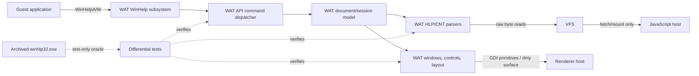
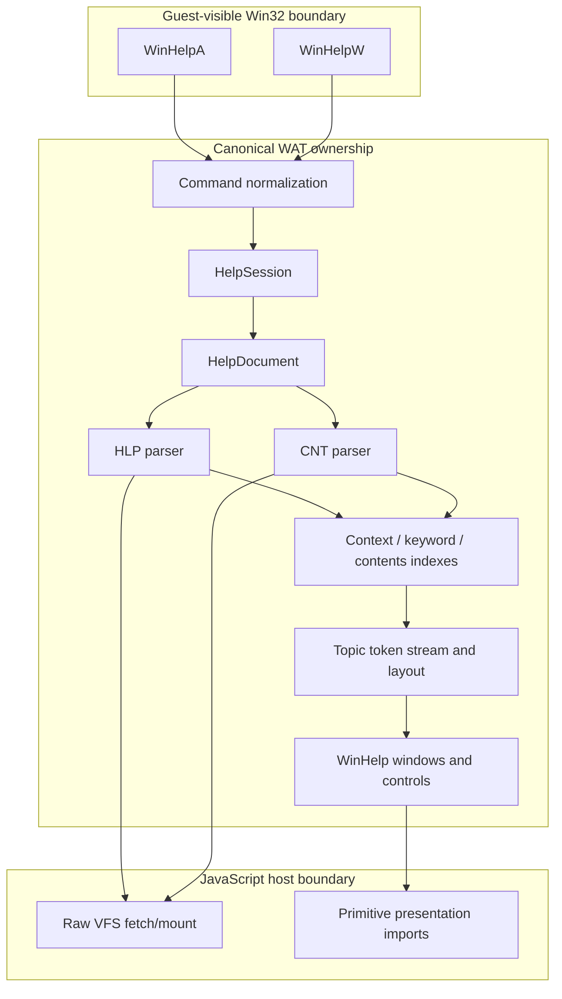
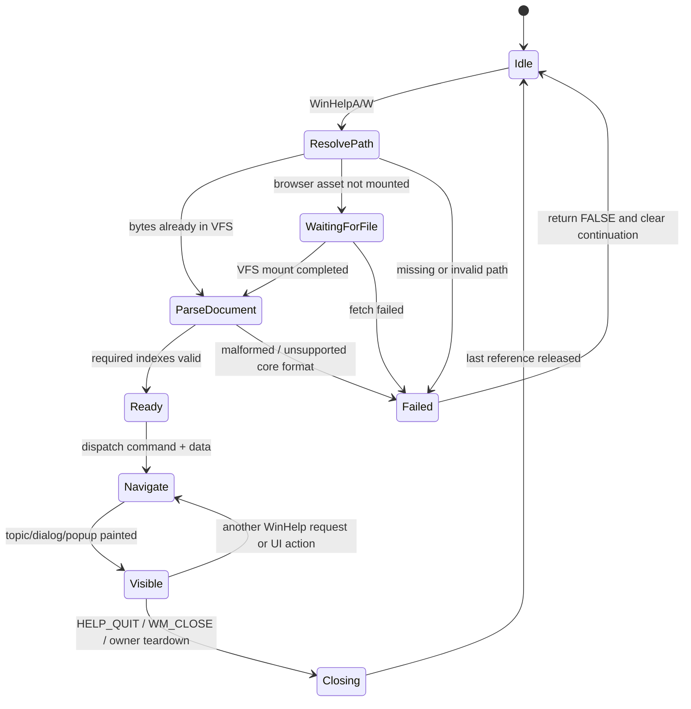
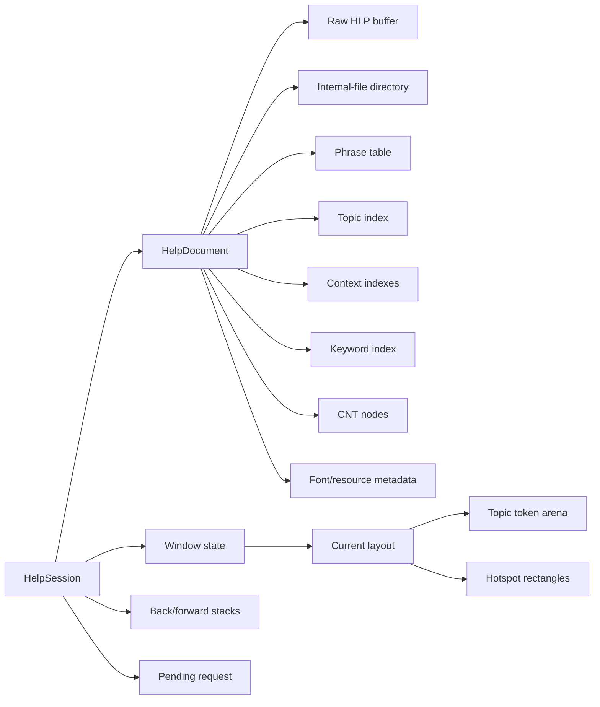
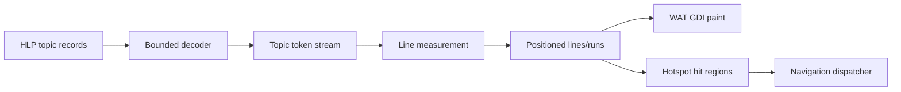
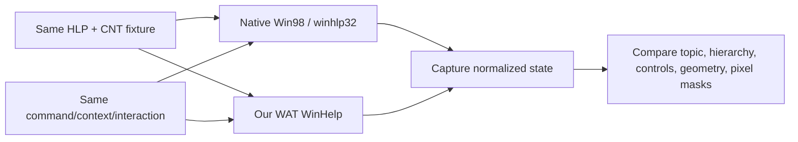

# WAT-native WinHelp design

Status: **implementation in progress**. Phase 1's WAT-owned file buffer,
bounded-reader foundation, directory B+tree parser, and raw VFS load path are
implemented. Phase 2 now parses `|SYSTEM`, canonical `|TTLBTREE` topics,
`|CONTEXT`, `|CTXOMAP`, and Hall `|PhrIndex`/`|PhrImage` phrase tables,
including two-level B+trees, bounded LZ77 expansion, and referential
validation. It also validates the complete `|TOPIC` link chain, binds canonical
topics to their type-2 records, and decodes phrase-expanded raw `LinkData2`
streams. Legacy `|Phrases` tables are supported in HC30, HC31, and MVB forms.
Formatted topic tokens and the runtime UI cutover remain.

This document defines the replacement for the current split WinHelp path. The
target implementation parses HLP and CNT data, interprets `WinHelpA/W`, owns
navigation state, and renders the user interface in WAT. JavaScript remains a
host for file availability and presentation primitives; it does not interpret
help formats or choose topics.

The archived Windows 98 `winhlp32.exe` under `test/binaries/help/` is a
reference oracle only. It is not a production dependency and must not be added
to the web application or deployment manifest.

## Decision

All WinHelp semantics belong in WAT:

- HLP internal-file directory and B+tree traversal;
- phrase decompression and topic record decoding;
- title, context, keyword, browse, font, bitmap, and macro metadata;
- CNT hierarchy and the in-memory search/index model;
- `WinHelpA/W` command dispatch and return values;
- document, window, history, selection, focus, and scroll state;
- topic layout, hotspot hit testing, and standard WinHelp UI behavior.

The host may:

- make raw files available through the VFS, including asynchronous browser
  fetch followed by a normal WAT resume;
- expose the existing low-level GDI/canvas presentation boundary;
- upload WAT-owned dirty rectangles and composite windows.

The host must not:

- parse HLP, CNT, or GID structures;
- return preselected or flattened help text;
- resolve a context ID, keyword, browse link, or contents node;
- own WinHelp history, selection, layout, or UI state.



## Why replace the current implementation

The current path is useful as a smoke test but is not a WinHelp
implementation:

```text
WinHelpA in 09a-handlers.wat
        |
        | ignores almost every uCommand and dwData
        v
host.help_open in lib/host-imports.js
        |
        | HlpParser parses a small subset and returns flattened text
        v
help_wndproc in 09c-help.wat
        |
        +-- fixed 400x300 window
        +-- plain lines of text
        +-- synthetic [Contents] and [Back] links
```

Specific gaps:

- `WinHelpA` handles `HELP_QUIT` but otherwise treats commands alike.
- `dwData`, caller ownership, new filenames, context IDs, keywords, and
  popups are ignored.
- `WinHelpW` returns success without doing any work.
- `lib/hlp-parser.js` guesses topic boundaries and titles and produces visibly
  corrupted text for several checked-in fixtures.
- CNT, context maps, keyword indexes, browse chains, formatting, hotspots,
  macros, and embedded images are not part of the runtime model.
- JavaScript caches one parser independent of pathname, while WAT separately
  owns the visible help window and history.
- Missing or malformed files can still lead to an empty window and a success
  return.

The replacement must remove this split ownership instead of extending it.

## Goals

1. Make F1 and context-sensitive Help open the requested topic in the checked-in
   Win98 applications.
2. Match Windows 98 topic, Contents, Index/Find, Back, popup, and close behavior
   closely enough for applications to rely on it.
3. Keep parsing deterministic, bounded, and testable without Canvas or a
   browser.
4. Reuse the existing WAT window/control/GDI systems rather than creating a
   second renderer or DOM UI.
5. Support ANSI and Unicode API entry points through one command engine.
6. Use the archived viewer and v86 captures for behavior and pixel oracles
   without shipping Microsoft binaries.
7. Fail cleanly on unsupported or malformed data; never silently select an
   unrelated topic.

## Non-goals for the first complete slice

- Bit-for-bit compatibility with every WinHelp macro.
- Executing arbitrary external commands embedded in help files.
- Persisting or consuming Windows-generated GID files.
- Full-text ranking identical to the native viewer.
- Supporting WinHelp 3.x variants before the Win98 fixture set works.
- Replacing host file fetch or final Canvas composition with WAT.

GID is a generated cache, not source content. The first WAT implementation
builds its own in-memory indexes from HLP and CNT data. A compatible GID cache
can be added later if startup time justifies it.

## Ownership boundary



The canonical copy of loaded help bytes resides in WASM memory. Parsed
structures store offsets into that buffer or WAT-owned heap pointers. A host
object must never be required to interpret or resume a topic operation.

## Public API behavior

Both entry points normalize into one internal call:

```text
help_dispatch(
    caller_hwnd,
    path_wa,          ;; normalized ANSI in WAT memory, or zero
    command,
    data,
    source_is_wide
) -> BOOL
```

`WinHelpW` converts the UTF-16 pathname and any command-specific string or
structure into bounded WAT-owned ANSI/UTF-8-compatible bytes before calling the
same engine. There must be no separate Unicode behavior stub.

### Command coverage

| Command | Required behavior | Priority |
|---|---|---:|
| `HELP_CONTEXT` | Resolve numeric context ID through `CTXOMAP`/context metadata and display that topic. | P0 |
| `HELP_QUIT` | Close windows owned by the caller/session and release document state when unused. | P0 |
| `HELP_CONTENTS` / `HELP_INDEX` | Open the configured contents/index entry point. | P0 |
| `HELP_FINDER` | Open the Help Topics dialog with the appropriate tab selected. | P0 |
| `HELP_CONTEXTPOPUP` | Render the requested context topic in a popup-style help window. | P1 |
| `HELP_KEY` | Resolve an exact keyword through the keyword B+tree. | P1 |
| `HELP_PARTIALKEY` | Open Find/Index with a prefix selection. | P1 |
| `HELP_CONTEXTMENU` | Map a control ID from the supplied table and enter popup help. | P1 |
| `HELP_WM_HELP` | Map the `HELPINFO` control ID through the supplied table. | P1 |
| `HELP_SETCONTENTS` | Change the contents entry point for the active document. | P2 |
| `HELP_MULTIKEY` | Resolve a named keyword table and key. | P2 |
| `HELP_SETWINPOS` | Apply a bounded `HELPWININFO` placement request. | P2 |
| `HELP_COMMAND` | Execute the supported, safe WinHelp macro subset. | P2 |
| `HELP_HELPONHELP` | Open the viewer's own help only if a redistributable internal topic exists. | Deferred |

Unknown commands return `FALSE` and set a diagnostic status. They must not
fall through to Contents while claiming success.

### Return and lifecycle rules

- Return `TRUE` only after the request is accepted, including an asynchronous
  load that has a valid continuation.
- Return `FALSE` for missing paths, malformed files, unresolved context IDs,
  unsupported command data, or allocation failure.
- A new non-null pathname may replace the active document; it must never reuse
  an unrelated cached parser.
- A null pathname reuses the caller's active document only where native command
  semantics permit it.
- Caller HWND is retained as owner state. Destruction and `HELP_QUIT` must not
  close an unrelated application's help session.
- Repeated requests focus or navigate the existing matching window instead of
  creating duplicates.

## Request and asynchronous-load state machine

The current yield reason `4=help_load` can remain, but the continuation becomes
WAT-owned. The host only finishes mounting bytes into the VFS.



The pending request record contains the normalized path, caller, command,
command data copy, and API return continuation. It must not retain raw guest
pointers across a yield because the caller can mutate or free them.

Long term, WinHelp should use normal VFS `CreateFile`/`ReadFile` machinery. A
temporary raw-byte import is acceptable during migration only if it has no HLP
semantics:

```text
vfs_request_mount(path_wa) -> READY | PENDING | NOT_FOUND
```

After resume, WAT opens and reads the mounted file. The existing
`help_open`, `help_get_title`, and `help_get_topic` semantic imports are removed
at the end of migration.

## HLP parsing pipeline

Parsing is bottom-up and each layer consumes bounded slices rather than naked
pointers.

```mermaid
flowchart TD
    B[Raw HLP byte buffer] --> H[Validate file header and size]
    H --> D[Parse internal-file directory B+tree]
    D --> SY[|SYSTEM]
    D --> PH[|PhrIndex + |PhrImage or |Phrases]
    D --> TO[|TOPIC]
    D --> TT[|TTLBTREE]
    D --> CX[|CONTEXT + |CTXOMAP]
    D --> KW[Keyword B+trees / data]
    D --> FO[|FONT]
    D --> BM[|bmN embedded resources]

    PH --> TD[Topic decoder]
    TO --> TD
    TT --> TI[Canonical topic index]
    CX --> TI
    KW --> KI[Keyword index]
    FO --> IR[Formatted topic IR]
    BM --> IR
    TD --> IR
    TI --> IR
```

### Bounded reader contract

Every parser function receives a `HelpSlice`:

```text
HelpSlice
  +0  base_wa       i32   start of complete HLP buffer
  +4  file_size     i32
  +8  offset        i32   slice offset from base
  +12 length        i32
```

Primitive readers return success separately from the value, using a shared
result global or an out pointer:

```text
help_read_u8(slice, relative_offset, out)
help_read_u16le(slice, relative_offset, out)
help_read_u32le(slice, relative_offset, out)
help_subslice(slice, relative_offset, length, out_slice)
help_read_cstring(slice, relative_offset, max_length, out_string)
```

Required invariants:

- validate `offset <= file_size` before addition;
- validate `length <= file_size - offset` to avoid wraparound;
- validate multiplication before page/table size calculations;
- never scan for NUL outside the current slice;
- cap B+tree depth, page count, entry count, and recursion;
- reject cyclic page links and overlapping records where the format forbids
  them;
- cap phrase count and total decompressed bytes;
- retain the first parse error code and source offset for diagnostics;
- do not publish partially initialized indexes.

### Directory and internal files

The internal-file directory maps names such as `|TOPIC` to HLP file offsets.
The WAT parser builds a compact sorted array:

```text
HelpInternalFile[entry_count]
  +0  name_hash     i32
  +4  name_off      i32   offset into HLP buffer
  +8  name_len      i16
  +10 flags         i16
  +12 data_off      i32   after internal-file header
  +16 data_len      i32
```

Lookup verifies both hash and bytes. Hash collision must never select the wrong
internal file.

### Phrase decompression

Phrase tables are parsed once into `{offset,length}` entries. Topic decoding
streams decompressed bytes into the topic-token builder; it does not allocate
one unbounded copy of the entire decompressed HLP.

Both Hall `|PhrIndex`/`|PhrImage` and older `|Phrases` forms are separate
decoders behind one interface. Tests must include malformed bit streams,
truncated phrase images, maximum-length phrases, and references to missing
entries.

### Canonical topic identity

The current flat `1..N` topic index is removed. A canonical topic reference is
the validated logical topic position used by the HLP tables:

```text
HelpTopic
  +0  topic_ref         i32
  +4  topic_record_off  i32
  +8  title_off         i32
  +12 title_len         i32
  +16 context_hash      i32
  +20 browse_prev_ref   i32
  +24 browse_next_ref   i32
  +28 flags             i32
```

All navigation sources resolve to `topic_ref`:

```text
numeric context ID ─┐
context hash ───────┤
keyword result ─────┼──> topic_ref --> decode/layout/display
CNT leaf ───────────┤
hotspot jump ───────┤
browse/back entry ──┘
```

`|TTLBTREE` supplies titles and topic positions. The first line of decoded
body text is not treated as a title unless the format genuinely lacks title
metadata.

## CNT and GID policy

CNT is parsed in WAT as a line-oriented source file. It supplies hierarchy and
links; it is not flattened into numbered text.

```text
HelpContentsNode
  +0  parent_index    i32   -1 for root
  +4  first_child     i32   -1 if none
  +8  next_sibling    i32   -1 if none
  +12 depth           i16
  +14 flags           i16   book, leaf, expanded, unresolved
  +16 title_ptr       i32
  +20 title_len       i32
  +24 topic_ref       i32   0 until resolved
  +28 context_string  i32   optional source link
```

The visual icon is derived from node state, not copied from the source:

```text
has children + collapsed  -> closed book
has children + expanded   -> open book
no children + topic       -> topic/page icon
unresolved target         -> disabled topic icon or explicit parse failure
```

GID is treated as an optional generated cache. Phase one ignores it and builds
the following indexes in memory:

- context ID to topic reference;
- context hash to topic reference;
- normalized keyword to one or more topic references;
- contents-node hierarchy;
- optional full-text token postings for Find.

This avoids version/staleness problems and keeps clean test runs independent
of a machine-generated file. A future GID reader/writer must be an optimization
with identical results, never the only path to content.

## Document and session memory model

All structures are heap-backed. Do not reserve another fixed low-memory table;
the existing low-memory map is already dense.



### HelpSession

One emulated process owns a bounded set of sessions keyed by caller/application
and pathname. The initial implementation may cap this at four live documents
and one primary window plus popups per document.

Conceptual fields:

```text
HelpSession
  state
  owner_hwnd
  document_ptr
  topic_hwnd
  topics_dialog_hwnd
  popup_hwnd
  current_topic_ref
  contents_selection
  active_tab
  scroll_x / scroll_y
  back_stack_ptr / count / capacity
  forward_stack_ptr / count / capacity
  pending_request_ptr
  last_error / last_error_offset
```

### Document arena

Each `HelpDocument` owns an arena chain. Parser indexes, copied strings, topic
tokens, and CNT nodes allocate from that arena. Closing the last session drops
the chain in one operation. Transient layout and search result arenas can be
reset without reparsing the document.

The original raw HLP buffer remains immutable until document teardown. Indexes
prefer offsets into it over duplicated bytes.

## Formatted topic intermediate representation

Flattening a topic to text loses the information required for layout,
hotspots, images, and accurate navigation. The topic decoder emits a bounded
WAT-owned token stream:

| Token | Payload |
|---|---|
| `TEXT` | source/copy offset, byte length |
| `SPACE` | breakability and width class |
| `LINE_BREAK` | hard/soft break |
| `PARAGRAPH` | indentation, spacing, tabs, alignment |
| `FONT` | parsed font/style index |
| `COLOR` | foreground/background color |
| `HOTSPOT_BEGIN` | jump type and target descriptor |
| `HOTSPOT_END` | no payload |
| `BITMAP` | validated embedded resource reference |
| `MACRO` | parsed safe macro opcode and operands |
| `END_TOPIC` | terminal marker |



Layout is deterministic and integer-based:

1. Resolve logical fonts through the existing WAT font/GDI system.
2. Measure tokens into the current client width.
3. Break lines at explicit and legal soft breaks.
4. Emit positioned runs and hotspot rectangles.
5. Paint only visible runs using the top-level window back-canvas.
6. Re-layout on width/font changes; scrolling does not reparse the topic.

Installed FNT faces stay on the canonical WAT font path. Unavailable scalable
faces may use the existing bounded Canvas fallback under the same GDI policy;
the topic model and positions remain WAT-owned.

## UI architecture

The implementation uses the existing WAT window table, controls, non-client
painting, menu system, and top-level back-canvas.

```text
Main help window
┌──────────────────────────────────────────────────────┐
│ caption / menu                                      │
├──────────────────────────────────────────────────────┤
│ [Help Topics] [Back] [Options]       command strip  │
├──────────────────────────────────────────────────────┤
│                                                      │
│ formatted topic viewport                             │
│ text, bitmaps, hotspots, vertical/horizontal scroll │
│                                                      │
└──────────────────────────────────────────────────────┘

Help Topics dialog
┌───────────────────────────────────────────────[?][X]┐
│ [Contents] [Index/Find]                              │
│ ┌──────────────────────────────────────────────────┐ │
│ │ closed/open books and topic leaves              │ │
│ │ selection, keyboard navigation, expansion       │ │
│ └──────────────────────────────────────────────────┘ │
│                         [Display] [Print...] [Cancel] │
└──────────────────────────────────────────────────────┘
```

Implementation rules:

- Use ordinary WAT `Button`, TreeView, tab, scrollbar, and dialog behavior
  where available.
- Keep custom topic layout in a WAT-native viewport wndproc.
- Draw into the owning top-level back-canvas; do not add a help-only surface.
- Derive `?` caption behavior from `DS_CONTEXTHELP`, as the generic renderer
  now does.
- Keep window geometry/profile state separate from document content. Tests
  that compare pixels must explicitly control both.
- Treat toolbar, menu, and Topics dialog actions as commands into the same
  navigation engine used by `WinHelpA`.

### Navigation transaction

```mermaid
sequenceDiagram
    participant E as Event/API
    participant N as Navigation engine
    participant I as Document indexes
    participant D as Topic decoder
    participant L as Layout
    participant W as Window

    E->>N: target descriptor
    N->>I: resolve to topic_ref
    alt unresolved
        I-->>N: error
        N-->>E: FALSE / visible diagnostic
    else resolved
        I-->>N: topic_ref
        N->>D: decode(topic_ref)
        D-->>N: bounded token stream
        N->>L: layout(tokens, client width)
        L-->>N: runs + hotspots + extent
        N->>N: push old topic; commit new state
        N->>W: invalidate/update scrollbars/title
        W-->>E: displayed
    end
```

The old topic remains visible until resolve, decode, and layout all succeed.
Navigation is transactional: malformed target data must not destroy a valid
current page or corrupt history.

## Macro and hotspot safety

Macros are parsed into typed opcodes before execution. Phase one supports only
the subset needed by fixtures and required for in-document navigation, such as
jumps, popup jumps, contents, back, and safe window commands.

These actions are disabled until explicitly designed and tested:

- launching external programs or documents;
- arbitrary DLL calls;
- filesystem mutation;
- shell execution;
- network navigation outside mounted VFS assets.

Unsupported macros remain visible in diagnostics and fail that action without
crashing the viewer. They must not be silently treated as successful.

## Source organization

The final split should follow WAT concatenation order and keep unrelated USER
tables out of the parser:

| File | Responsibility |
|---|---|
| `src/09a-handlers.wat` | Thin `WinHelpA/W` ABI handlers calling `help_dispatch`. |
| `src/09c-help.wat` | Existing generic window/class tables; remove the legacy flattened help implementation after cutover. |
| `src/09c6-winhelp-core.wat` | Sessions, documents, command normalization, lifecycle, async continuation, navigation/history. |
| `src/09c7-winhelp-hlp.wat` | Bounded readers, directory, phrase, topic, title, context, keyword, font, and resource parsing. |
| `src/09c8-winhelp-cnt.wat` | CNT parser, contents hierarchy, generated in-memory indexes. |
| `src/09c9-winhelp-ui.wat` | Topic IR/layout, wndprocs, dialogs, toolbar/menu actions, hotspots, painting. |
| `lib/host-imports.js` | Raw VFS mount/fetch and existing rendering primitives only. |
| `lib/hlp-parser.js` | Temporary runtime fallback/comparison point; delete after WAT cutover. It is not a correctness oracle. |

Names may change during implementation, but parser and UI code should not be
folded into the already-large generic handlers file.

## Testing strategy

Testing has four layers.

### 1. Pure parser tests

Expose test-only WAT entry points that accept a buffer already copied into
WASM memory. Tests inspect WAT-owned records, not host-parser results.

Required fixtures and assertions:

- all checked-in HLP files parse or fail with a documented format gap;
- exact internal-file names, offsets, and lengths;
- exact title strings from `|SYSTEM`/title metadata;
- exact topic count, canonical references, and titles;
- known context IDs resolve to expected topic references;
- phrase decompression yields exact byte strings;
- malformed/truncated variants fail at exact stages without out-of-bounds
  access or partial published state;
- parser tests run with no renderer and no semantic help host imports.

### 2. API command tests

Use a tiny guest fixture or exported ABI harness to call `WinHelpA/W` with
controlled arguments:

- context, contents, finder, key, partial key, popup, and quit;
- null versus new filename;
- ANSI versus Unicode pathname/data;
- missing file and missing context;
- two caller HWNDs and two HLP files;
- yield/resume with guest pointers mutated after the initial call;
- close/reopen without stale parser reuse;
- exact BOOL return and stack cleanup.

### 3. UI behavior and visual tests

Build deterministic state captures for each fixture:

```text
main topic
Contents default
expanded book
selected leaf
Display result
Back result
Index/Find tab
context popup
context-help caption button
```

Assertions combine window/control dumps, selected topic/state, exact text, and
small stable pixel masks. Full-image hashes are avoided where font fallback or
desktop placement can vary.

### 4. Differential reference tests

For each scenario, provide identical HLP/CNT bytes and request semantics to
Windows 98/v86 and the WAT implementation.



The archived executable remains hash-pinned in tests. It is never copied into
production assets. Native GID files are generated in isolated temporary
directories and deleted after capture.

## Diagnostics

Add a runtime trace category rather than ad-hoc logging:

```text
--trace-help
  api caller=... path=... command=... data=...
  load state=ready|pending|failed size=...
  parse internal="|TOPIC" off=... len=...
  resolve kind=context id=... topic_ref=...
  navigate from=... to=... history=...
  layout tokens=... lines=... extent=...
  error code=... file_off=...
```

Useful test-only exports may expose counts and immutable record fields. They
must not become an alternate host-owned code path.

Suggested stable error classes:

- bad outer header;
- directory/B+tree corruption;
- missing required internal file;
- phrase table corruption;
- topic record corruption;
- unresolved context/keyword;
- unsupported command or macro;
- allocation/capacity limit;
- VFS missing/fetch failure.

## Capacity limits

Initial limits should be explicit constants and tested at their boundaries.
Proposed starting envelope:

| Resource | Initial cap |
|---|---:|
| HLP file bytes | 32 MiB |
| Internal directory entries | 4,096 |
| B+tree depth | 16 |
| B+tree pages per internal file | 65,536 |
| Phrases | 65,536 |
| Single decompressed phrase | 64 KiB |
| Topics | 65,536 |
| CNT nodes | 16,384 |
| CNT nesting depth | 64 |
| Topic token count | 262,144 |
| Decompressed bytes for one topic | 4 MiB |
| Hotspots for one topic | 16,384 |
| History entries | 256 |
| Live documents per process | 4 |

These are compatibility and safety bounds, not promises about native WinHelp.
Raise them only with a real fixture and memory/overflow regression.

## Migration plan

### Phase 0: lock the oracle and expose the gap

- Keep current native/emulator screenshots and archived executable hash checks.
- Add fixture expectations for real internal-file tables and selected native
  topic text/context mappings.
- Add explicit tests demonstrating corruption or missing context behavior in
  the JS parser; do not encode corrupted output as desired behavior.

Exit criterion: the expected WAT parser outputs and native UI states are known
for FreeCell plus at least Calculator, Notepad, Paint, and WordPad.

### Phase 1: WAT file buffer, bounded readers, and directory

Status: **implemented**. The focused parser gate covers all checked-in HLP
directories plus synthetic multi-page/indexed trees, source-buffer mutation,
cyclic links, truncation, invalid internal-file headers, and capacity bounds.

- Mount/read HLP bytes through VFS into a document arena.
- Implement outer header, internal-file header, and directory B+tree.
- Add parser error/status exports and malformed fixtures.

Exit criterion: WAT enumerates the exact internal-file directory for every
checked-in HLP with no call to `HlpParser`.

### Phase 2: titles, phrases, topics, and context maps

Status: **partially implemented**. Document metadata, canonical topic/title
records, signed context-hash indexes, numeric context maps, and Hall phrase
tables are WAT-owned. The bounded topic-block decoder now validates physical
LZ77 blocks and the complete forward/back `TOPICLINK` chain, binds every
canonical title entry to its type-2 record, and phrase-expands each topic's raw
`LinkData2` stream while preserving paragraph-control bytes. All checked-in
fixtures have exact topic-reference, context-resolution, decompressed-phrase,
raw-topic-length, and full-corpus hash coverage, supplemented by synthetic
two-level trees and malformed semantic/topic inputs. The canonical phrase
interface also covers uncompressed HC30 `|Phrases`, LZ77-compressed HC31
tables, and the extended MVB layout, including legacy topic-reference spacing
semantics and malformed-table cleanup. Formatted topic-token decoding is next.

- Parse `|SYSTEM`, phrase tables, `|TOPIC`, `|TTLBTREE`, `|CONTEXT`, and
  `|CTXOMAP`.
- Emit exact topic titles/text token streams.
- Build numeric and hashed context indexes.

Exit criterion: known context IDs resolve and decoded plain text matches native
reference content for all fixtures.

### Phase 3: real API dispatcher and basic topic window

- Implement ANSI/Unicode normalization and transactional requests.
- Support P0 commands and correct return/lifecycle semantics.
- Replace flattened JS topic access with WAT document/topic state.
- Render text tokens and Back/Contents through the existing WAT window.

Exit criterion: application F1/help-menu requests open the requested topic;
close/reopen and multiple paths do not reuse stale state.

### Phase 4: CNT and Help Topics dialog

- Parse CNT hierarchy.
- Bind books/leaves to canonical topics.
- Implement Contents and Index/Find tabs with keyboard/mouse interaction.

Exit criterion: hierarchy, selection, expansion icons, Display, and Back match
the native fixture matrix.

### Phase 5: formatted topics, hotspots, popups, and images

- Complete font/paragraph token decoding and deterministic layout.
- Implement jump/popup hotspots and context popups.
- Decode embedded bitmap resources into WAT-owned GDI bitmaps.

Exit criterion: visual topic captures and hotspot target transitions match the
reference for fixtures containing `|FONT` and `|bmN` data.

### Phase 6: keyword/search and safe macros

- Parse keyword indexes and implement exact/prefix lookup.
- Build the in-memory Find index without requiring GID.
- Add the fixture-driven safe macro subset.
- Remove `lib/hlp-parser.js` from the browser runtime and delete semantic help
  imports.

Exit criterion: all supported commands use WAT-owned state, production loads no
JS HLP parser, and the archived viewer remains test-only.

## Definition of done

The WAT-native WinHelp effort is complete for the supported Win98 corpus when:

- `WinHelpA` and `WinHelpW` share a real command dispatcher;
- P0 and P1 commands have exact API and lifecycle tests;
- HLP and CNT parsing is entirely WAT-owned and bounds-checked;
- context IDs, keywords, contents nodes, hotspots, and history use canonical
  topic references;
- topic text is no longer corrupted or guessed from arbitrary first lines;
- Contents/Find, books/leaves, Display, Back, popups, and close behavior match
  native reference states;
- formatted text and checked-in embedded bitmaps render through canonical WAT
  GDI surfaces;
- malformed files and unsupported commands fail deterministically;
- JavaScript contains no help-format parser or semantic topic callbacks;
- production assets do not include `winhlp32.exe`, GID caches, or other
  Microsoft reference binaries.
