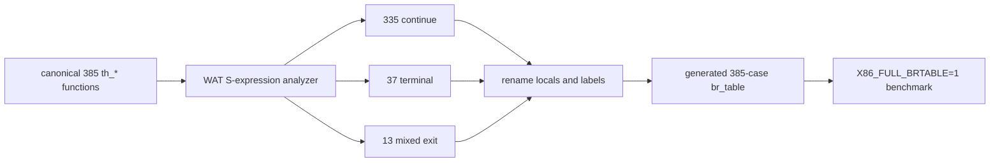

# Guarded x86 Hot-Subset Dispatcher Benchmark

Date: 2026-08-12

## Question

Can a generated `br_table` loop execute a corpus-hot subset of decoded x86
handlers while preserving the existing threaded interpreter as an exact
fallback?

## Implementation under test

The experimental runner preflights an entire decoded block before changing
guest state. If every handler is supported, it executes the block in one
`br_table` function. If any handler is unsupported, it restores the packet IP
and runs the original `$next`/`call_indirect` chain. The production hook is
disabled by default and is selected with `X86_HOT_SUBSET=1`.

The current subset contains 16 generic handler families used by the four-block
AoE fixture. The benchmark also has an exact-operand direct-register variant,
but the main-loop hook uses the safer generic-handler variant.

## Correctness

The following passed against the rebuilt tail-call and compatibility modules:

```text
PASS  AoE br_table hot subset falls back to x86 with exact state
PASS  AoE packet, stack, four-slot, and optimized blocks match x86 decoder
PASS  profile-guided exact handlers match generic threaded handlers
PASS  wasm-tools validate build/wine-assembly.wasm
PASS  wasm-tools validate build/wine-assembly.compat.wasm
```

The fallback test uses an unsupported `mov eax,imm32; ret` block and compares
all general registers, EIP, and ESP. The broader AoE differential suite routes
its block corpus through the main-loop hot-subset hook and compares registers,
lazy flags, watched memory, and EIP.

## Fixed-work benchmark

Command:

```sh
env BLOCKS=2000000 WARMUP_BLOCKS=2000000 TRIALS=9 WARM_ONCE=1 \
  VARIANTS=x86-threaded,brtable-generic-local-ip,brtable-subset-generic,brtable-direct-generic-alu,brtable-subset-direct \
  node tools/bench-aoe-recompile-loop.js
```

Results:

| Variant | Median ms | Paired vs x86 |
|---|---:|---:|
| x86 `call_indirect` | 147.39 | 1.000x |
| generic `br_table`, no guard | 63.33 | 2.254x |
| generic `br_table` + block preflight | 123.61 | 1.166x |
| direct `br_table`, no guard | 40.69 | 3.585x |
| direct `br_table` + exact-form preflight | 129.28 | 1.103x |

The production-shaped generic subset retained a 16.6% paired speedup, but
repeated packet scanning consumed most of the guard-free upper bound.

## Classify-once pointer-tag follow-up

The follow-up does not change the decoder or production cache. The benchmark
harness tags already-decoded aligned packet pointers with bit zero. A
benchmark-only selector pays one tag test, pointer mask, and branch; untagged
packets fall directly into `$next`.

Hot-only command:

```sh
env BLOCKS=2000000 WARMUP_BLOCKS=2000000 TRIALS=31 WARM_ONCE=1 \
  VARIANTS=x86-threaded,brtable-generic-local-ip,brtable-subset-generic,brtable-cached-generic \
  node tools/bench-aoe-recompile-loop.js
```

| Variant | Median ms | Paired vs x86 |
|---|---:|---:|
| x86 `call_indirect` | 142.46 | 1.000x |
| guard-free generic `br_table` | 63.67 | 2.221x |
| rescan every block | 109.53 | 1.301x |
| cached HOT tag | 64.93 | 2.219x |

Cached-HOT is effectively identical to the guard-free ceiling. The aggregate
median is about 2% slower, while the paired ratios differ by only 0.1%.

Mixed-path command:

```sh
env BLOCKS=500000 WARMUP_BLOCKS=2000000 TRIALS=51 WARM_ONCE=1 \
  VARIANTS=x86-threaded,brtable-subset-generic,brtable-cached-mixed \
  node tools/bench-aoe-recompile-loop.js
```

Only `0x00535c20` was tagged, so one of four block entries was hot and each
cycle exercised both branches of the selector.

| Variant | Median ms | Paired vs x86 |
|---|---:|---:|
| x86 `call_indirect` | 36.32 | 1.000x |
| rescan every block | 28.12 | 1.314x |
| cached 25%-hot / 75%-cold | 22.52 | 1.595x |

The tagged block is longer than the other three fixture blocks, so this is a
selector-cost proxy rather than an estimate of a 25%-covered application. It
does show that the same selector remains profitable while naturally executing
both hot and cold paths.

## Full-browser profiles

All runs used headless Chrome, muted audio, `HANDLER_HIST=0`,
`HOTFORM_SPECIALIZE=0`, 100,000 blocks per run slice, and a nominal ten-second
measurement window.

### AoE

| Metric | Baseline 1 | Candidate 1 | Delta | Baseline 2 | Candidate 2 | Delta |
|---|---:|---:|---:|---:|---:|---:|
| runSlice average, ms | 11.709 | 9.587 | -18.1% | 9.264 | 9.506 | +2.6% |
| completed slices | 593 | 679 | +14.5% | 695 | 685 | -1.4% |
| guest/unwrapped total, ms | 6065.3 | 5764.3 | -5.0% | 5673.0 | 5777.7 | +1.8% |
| present FPS | 12.349 | 14.411 | +16.7% | 14.622 | 14.446 | -1.2% |
| repaint FPS | 55.613 | 59.008 | +6.1% | 59.438 | 58.897 | -0.9% |
| subset coverage | - | 26.1% | - | - | 26.0% | - |

The first pair was strongly positive; the repeat was slightly negative. This
does not meet the repeatability requirement for a production optimization.

### RCT cold-fallback stress

RCT hit no supported blocks in this subset.

| Metric | Baseline | Candidate | Delta |
|---|---:|---:|---:|
| runSlice average, ms | 2249.54 | 2244.22 | -0.24% |
| completed slices | 5 | 5 | 0.0% |
| guest/unwrapped total, ms | 11247.7 | 11221.1 | -0.24% |
| hot blocks | 0 | 0 | - |
| fallback blocks | 0 | 500000 | - |

The matched pair is effectively neutral, so this run found no measurable
cold-fallback penalty.

## Decision

Keep the experiment and tests, but keep it disabled by default. The next
implementation below classifies each decoded block once and caches its hot/cold
eligibility instead of rescanning the packet on every entry. Expand the
generic handler subset from AoE and RCT corpus histograms and require at least
three matched full-app pairs before considering default enablement.

## Production cache-metadata prototype

The production-shaped follow-up stores one eligibility bit per decoded-cache
slot in a parallel 512-byte bitmap for each emulator thread. Classification
runs at `cache_store`, after the decoder has emitted the final packet, and
accepts both generic handler IDs and the existing AoE/RCT exact-form aliases.
The main loop performs its ordinary cache lookup once, checks the bit, and:

- calls the generated `br_table` packet executor for a hot packet;
- continues through the existing `$next` path for a cold packet.

Cache replacement naturally overwrites the bit. Full cache clears, page
invalidation, thread initialization, and feature toggles clear the corresponding
metadata. Tests cover supported exact forms, unsupported fallback with exact
guest state, colliding cache slots, invalidation, and toggling.

Fixed-work command:

```sh
env BLOCKS=2000000 WARMUP_BLOCKS=2000000 TRIALS=31 \
  VARIANTS=x86-threaded,x86-cached-subset-production \
  node tools/bench-aoe-recompile-loop.js
```

| Variant | Median ms | Paired vs x86 |
|---|---:|---:|
| x86 `call_indirect` | 147.31 | 1.000x |
| production cached subset | 73.59 | 1.998x |

This still uses the four-block all-hot kernel. Its purpose is to verify that
real cache insertion, exact-form decoding, the main `run` entry point, and
cached dispatch retain most of the generated executor's isolated benefit.

The corrected full-browser AoE pair used 30 seconds of scripted campaign
gameplay, muted audio, `HANDLER_HIST=0`, and `HOTFORM_SPECIALIZE=1`:

| Metric | Baseline | Cached subset | Delta |
|---|---:|---:|---:|
| `main.runSlice` total | 19820.7 ms | 19238.7 ms | -2.94% |
| guest/unwrapped total | 17094.0 ms | 16428.8 ms | -3.89% |
| completed slices | 1998 | 2112 | +5.71% |
| present FPS | 16.285 | 17.355 | +6.57% |
| repaint FPS | 58.652 | 59.415 | +1.30% |
| hot block entries | - | 61,479,047 | - |
| cold block entries | - | 149,711,927 | - |
| hot coverage | - | 29.1% | - |

The candidate screenshot shows valid campaign gameplay. This is one positive
full-app pair, not sufficient evidence to enable the feature by default.

The RCT census identified seven generic handler families to add: absolute/SIB
32-bit memory ALU, `CMPSB`, base-plus-displacement 32-bit and 8-bit memory ALU,
SIB effective-address calculation, and `POP EDX`/`POP EBX`. Its three dominant
byte-ADD forms already decode to exact-form IDs when specialization is enabled.
The stable RCT packet contains more than the interpreter's per-slice limit, so
both classification and generated execution accept and execute exactly 999
non-terminal handlers. This preserves the existing scheduler cutoff instead of
running ahead to an eventual branch.

A matched 30-second warmup plus 10-second measured RCT browser pair then routed
100% of the measured loop through generated dispatch:

| Metric | Baseline | Expanded subset | Delta |
|---|---:|---:|---:|
| median `main.runSlice` | 2134.0 ms | 745.0 ms | -65.1% / 2.864x |
| average `main.runSlice` | 2153.1 ms | 742.6 ms | -65.5% / 2.899x |
| completed slices | 5 | 14 | 2.80x throughput |
| hot block entries | - | 1,400,000 | - |
| fallback entries | - | 0 | - |

This is a real full-browser RCT run with a visible RCT window, but the harness
parks in a stable instruction-heavy loop at `EIP=0x00850000`; it is not yet
interactive park gameplay. Treat the magnitude as evidence for this loop and
for the dispatch mechanism, not as an end-user RCT frame-rate claim. A
differential test covers every observed handler family, the three exact forms,
memory/register/flag state, SIB addressing, and the 999-handler cutoff.

The feature remains disabled globally pending repeated full-app trials and a
rendered, interactive RCT gameplay harness. It now has measured hot coverage in
both profiled applications rather than requiring AoE-only gating.

The machine-readable summary is in
`docs/x86-hot-subset-benchmark-results.json`. Original browser profiles were
large temporary harness artifacts and are intentionally not committed.

## Automatically generated whole-table control

The repository's own WAT S-expression parser now inventories the canonical
thread table and mechanically clones handler bodies into one `br_table`
dispatcher. It does not translate x86 semantics. It renames labels and locals,
maps the handler parameter to the dispatcher operand, changes
`return_call $next` into a dispatch-loop branch, changes ordinary returns into
block exits, zeroes reused scratch locals, and preserves `$next`'s decrement-
before-dispatch 999-handler limit.



All 385 table entries are structurally convertible in the current source. No
handler has a non-tail call to `$next`, foreign tail call, unresolved function,
or numeric local reference. The generated WAT is 279,880 bytes, shares at most
30 `i32` and five `i64` scratch locals, and increases the compiled primary Wasm
from 381,917 to 411,122 bytes (+29,205 / 7.6%). The original functions remain
only to provide the baseline and differential oracle while evaluating the
architecture.

The direct three-way fixture command is:

```sh
env VARIANTS=x86-threaded,x86-full-brtable,x86-cached-subset-production \
  TRIALS=31 BLOCKS=2000000 WARMUP_BLOCKS=2000000 \
  node tools/bench-aoe-recompile-loop.js
```

| Variant | Median ms | Paired vs x86 |
|---|---:|---:|
| x86 `call_indirect` | 223.78 | 1.000x |
| automatic 385-case `br_table` | 161.06 | 1.362x |
| compact cached corpus subset | 104.66 | 2.204x |

The whole-table path therefore proves that dispatch conversion alone is
profitable, but also that one giant function leaves substantial performance on
the table versus a compact corpus-selected dispatcher.

A single 30-second full-browser AoE campaign pair showed the same mixed result:

| Metric | Baseline | Whole table | Delta |
|---|---:|---:|---:|
| `main.runSlice` total | 19820.7 ms | 19974.6 ms | +0.78% |
| guest/unwrapped total | 17094.0 ms | 16565.1 ms | -3.09% |
| completed slices | 1998 | 2003 | +0.25% |
| present FPS | 16.285 | 16.048 | -1.46% |
| repaint FPS | 58.652 | 58.099 | -0.94% |
| generated block entries | - | 200,289,197 | - |

The screenshot shows valid campaign gameplay. Guest CPU improved, but the
end-to-end frame metrics do not justify preferring the giant dispatcher over
the compact subset from this pair.

On RCT's stable warm loop, the whole table reduced median slices from 2134.0
to 1160.5 ms (1.839x) and average slices from 2153.1 to 1170.0 ms (1.840x),
with 900,000 generated block entries. The compact RCT subset remains much
faster at 745.0 ms median (2.864x). This remains the non-interactive parked RCT
loop caveat described above.

The practical direction is therefore automated generation of several compact
tables or a hot-table plus full-table fallback, rather than shipping one
monolithic 385-case function. The new full-table mode makes that choice cheap
to remeasure whenever handlers or browser engines change.
