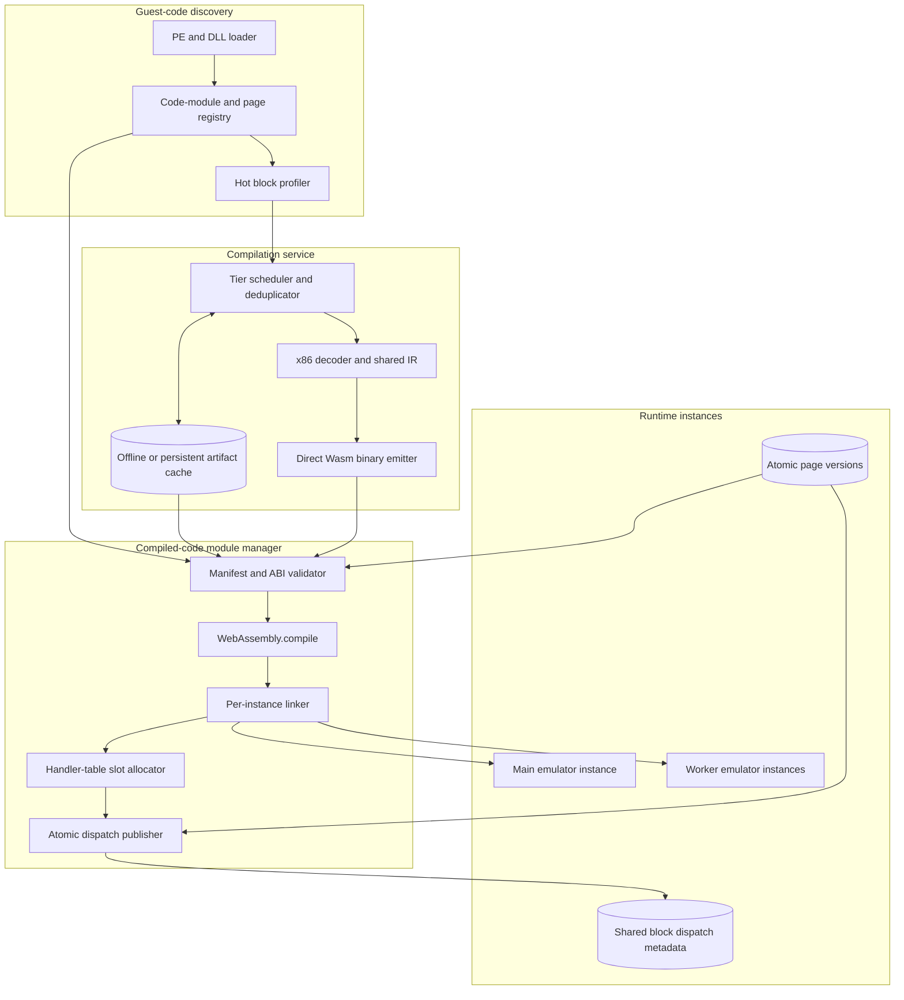
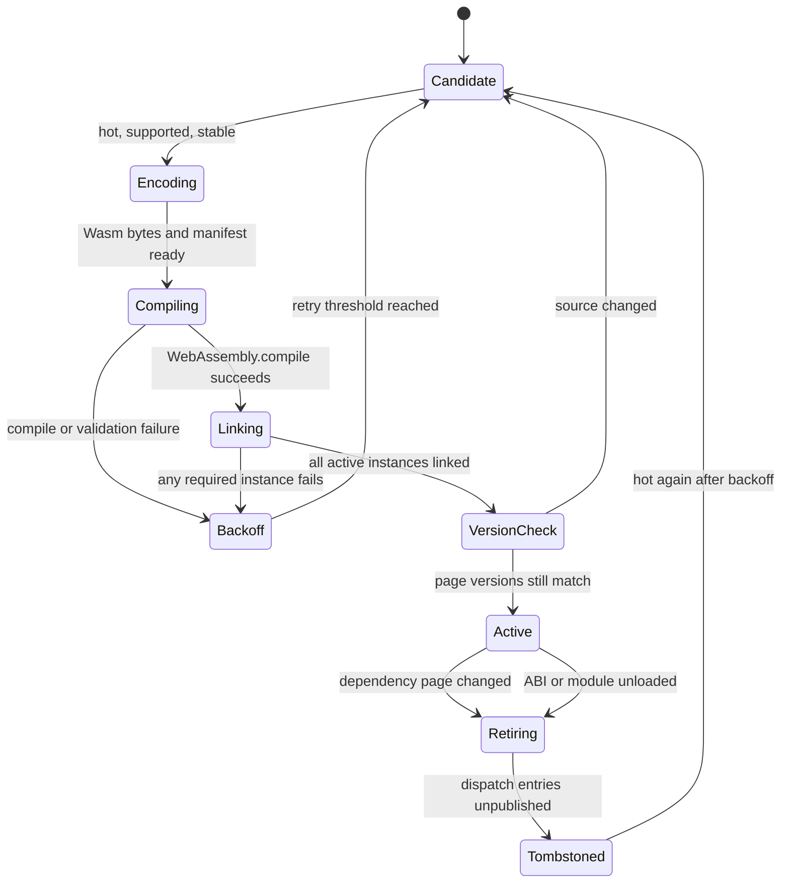
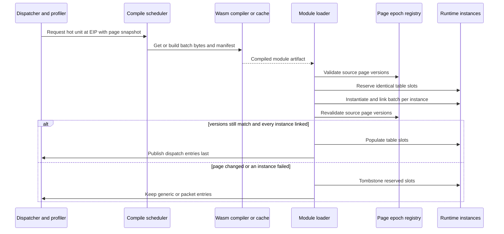

# Direct x86-to-Wasm Compiler Design

Status: proposed. The AoE branch has hand-written direct-WAT functions that
measure the potential, but it does not yet contain a general compiler.

Related design: [WAT-Threaded Packet Backend](wasm-stack-threaded-code.md)

## ASCII TL;DR

```text
                                      DIRECT x86-TO-WASM TIER

  LOAD (do not compile raw file bytes)                         RUN (startup never waits for whole EXE)
 +----------------+   +----------------+   +----------------+  +-------------------------------+
 | map PE sections|-->| loader patches |-->| imports/thunks |->| x86 threaded / packet fallback|
 +----------------+   +----------------+   +-------+--------+  +---------------+---------------+
                                                   |                           |
                                                   v                           v hot + stable
                                         +-------------------+      +---------------------------+
                                         | page versions and |----->| x86 IR -> direct Wasm BIN |
                                         | mapped-byte hash  |      | async batch compilation   |
                                         +---------+---------+      +-------------+-------------+
                                                   ^                              |
                                                   | validate versions            v
 guest memory + instance CPU globals               |                  +--------------------------+
 +--------------------------------------+          +------------------| auxiliary Wasm instance  |
 | shared Memory; exported globals,     |<----------------------------| shared imports + table fn|
 | helpers, and growable handler table  |                             +-------------+------------+
 +-------------------+------------------+                                           |
                     ^                                                              v
                     +---------------- direct specialized execution <--- dispatch installed slot
                     |
          code-page write -> increment version -> unpublish dependent slot -> fall back/recompile

  KNOWN BUNDLED EXE: HASH-VALIDATED OFFLINE .WASM     ARBITRARY EXE: PROFILE, COMPILE, INSTALL LAZILY
```

## Mermaid Overview

```mermaid
flowchart LR
    PE[PE file] --> Map[Map sections]
    Map --> Patch[Loader patches and imports]
    Patch --> Pages[Module registry and page versions]
    Pages --> T0[x86-threaded or packet execution]
    T0 --> Profile[Hot and stable block profile]
    Profile --> IR[Normalized x86 IR]
    IR --> Emit[Emit Wasm binary batch]
    Emit --> Compile[WebAssembly.compile]
    Compile --> Loader[Compiled-code module loader]
    Runtime[(Memory, globals, helpers, handler tables)] --> Loader
    Pages --> Loader
    Loader --> Aux[Auxiliary Wasm instances]
    Aux --> Table[Installed handler-table slots]
    Table --> Direct[Direct specialized execution]
    Direct --> Runtime
    Write[Tracked code-page write] --> Pages
    Pages -->|version changed| Retire[Unpublish and retire dependent units]
    Retire --> T0
```



## Decision

Direct x86-to-Wasm compilation is feasible, but eagerly compiling an entire
arbitrary EXE while it loads is not the recommended first implementation.

Use this execution pipeline instead:

```text
map PE image and finish loader patches
  -> begin execution with existing x86 threaded interpreter
  -> identify hot, stable blocks and short traces
  -> lower the shared normalized x86 IR to Wasm binary
  -> compile an auxiliary Wasm module asynchronously
  -> validate source-page versions
  -> install compiled functions in a shared dispatch table
  -> fall back on unsupported, cold, changed, or debugged code
```

For a bundled, known EXE such as one exact AoE build, an offline ahead-of-time
artifact is also practical. It should be keyed to a cryptographic hash of the
input image and validated at load. Arbitrary uploaded EXEs should use the
tiered path.

The production backend should be called "direct x86-to-Wasm," not "compile to
WAT." WAT is a readable text representation and is useful for debug dumps and
tests. Browsers compile encoded Wasm module bytes through `WebAssembly.compile`;
they do not natively compile WAT text. The compiler should therefore emit Wasm
binary directly and optionally print equivalent WAT for inspection.

## Feasibility And Self-Modifying Code

### Do EXEs Often Change Themselves?

Normal data mutation does not matter. A game can update the heap, stack,
globals, frame buffers, and import-address data continuously without
invalidating compiled instructions. Only writes that can change bytes from
which a compiled unit was decoded are relevant.

Many ordinary Win32 programs have stable code after loading. Loader fixups,
import resolution, and emulator thunk setup happen before compilation and can
be treated as part of the loaded image identity. However, x86 software can also
contain:

- unpackers or copy-protection code that rewrites or reveals code at startup;
- generated callbacks, trampolines, or code in nominal data sections;
- executable writable memory;
- overlays, dynamically loaded modules, or patched DLL entry points; and
- genuinely self-modifying loops.

This repository already assumes that execution may begin outside the PE code
range: `$cache_store` tracks image pages outside `.text` after they are decoded,
and guest stores invalidate those generated-code pages. That is evidence that
a compiler must support code discovery and invalidation; it is not evidence
that direct compilation is infeasible.

The correct engineering response is versioning plus fallback, not rejecting
mutable programs. Stable hot pages become direct Wasm. Repeatedly changing
pages remain in the generic or packet tier.

### Why Not Compile The Whole EXE At Load?

Static x86 discovery is incomplete in the general case:

- x86 instructions have variable length, so bytes cannot be decoded correctly
  without choosing instruction boundaries;
- code and embedded data can share a section;
- indirect jumps, virtual calls, callbacks, and return targets are not all
  recoverable from a recursive traversal;
- compilers sometimes place executable bytes in sections marked as data;
- DLLs and plugins can arrive after the main image; and
- compiling cold code increases startup time and browser compilation work
  without improving execution.

A load-time recursive traversal from known entry points is still useful as a
seed. It must remain conservative, and missed targets must decode normally on
first execution.

### When Compilation May Start

Never compile from raw file offsets before the PE image is mapped. Decode from
the final guest-visible bytes after every loader transformation that can affect
instruction bytes or addresses, including the loader's import/thunk setup and
any supported relocation or patch phase.

The safe sequence is:

```text
1. parse and map PE sections
2. perform loader relocation/patch work supported by the runtime
3. resolve imports and create guest thunks
4. establish module and executable-page metadata
5. hash/version the mapped source pages
6. seed analysis from entry points and known exports
7. begin execution and collect block heat
8. compile only after a unit is supported, hot, and currently stable
```

The current main Wasm module is instantiated before `load_pe` maps the EXE, so
EXE-specific functions cannot simply be appended to that live module. WebAssembly
modules are deployment and compilation units; a running instance does not grow
new defined functions. The practical design is one or more auxiliary compiled
modules instantiated after the main runtime.

## Execution Tiers

Use one front end and three interchangeable backends:

```text
tier 0: x86 threaded
  current generic handler stream
  complete fallback and debugging reference

tier 1: WAT-threaded packet
  normalized packet data executed by a static WAT VM
  immediate installation, moderate optimization

tier 2: direct Wasm
  specialized Wasm functions compiled asynchronously
  highest startup cost and highest speed potential
```

The AoE four-block microbenchmark currently measures:

```text
variant          blocks/ms   vs x86-threaded
x86 threaded       13301.4        1.000x
WAT threaded       29201.3        2.195x
WAT optimized      44523.6        3.347x
```

The optimized result is hand-written and AoE-specific. It is a target for the
compiler design, not a claim that a general compiler already achieves it.

## Shared Compiler Front End

The packet and direct backends must share decoding, correctness rules, and
analysis. The normalized IR should make these concepts explicit:

- guest instruction start and end EIP;
- full and partial register reads/writes;
- flag inputs, definitions, preserved bits, and consumers;
- effective-address expression and memory width;
- load/store ordering and conservative alias boundaries;
- calls, returns, direct and indirect control flow;
- helper/API boundaries and potential faults; and
- exact normal and side-exit state.

Initial analysis passes:

1. basic-block formation and supported-op classification;
2. register liveness and dirty-state computation;
3. lazy-flag producer/consumer analysis;
4. constant folding and copy propagation;
5. dead register and dead flag write elimination;
6. effective-address common-subexpression detection; and
7. trace selection using measured branch behavior.

Correctness must not depend on profile assumptions. Profiles choose which
valid path is compiled and where guards are worthwhile; guards protect every
assumption that can change.

## Wasm Module Architecture

### Current Constraint

The main Wine-Assembly module already imports and exports the same shared
`WebAssembly.Memory`, which auxiliary modules can import. CPU registers, lazy
flags, helper functions, and the current handler table are private to each main
module instance. Direct functions need an explicit ABI to reach that state.

WebAssembly supports importing and exporting functions, tables, memories, and
globals, and `WebAssembly.compile(bytes)` asynchronously compiles a module from
binary bytes. See the official
[WebAssembly JavaScript Interface](https://webassembly.github.io/spec/js-api/)
and [core module model](https://webassembly.github.io/spec/core/syntax/modules.html).

### Initial ABI: Instance Globals And Shared Function Table

The lowest-risk first ABI keeps the current CPU representation:

1. Export the handler table from each main runtime instance and allow it to
   grow beyond the static generic-handler range.
2. Export the mutable CPU globals required by compiled code: general registers,
   EIP, lazy flags, step budget, and selected runtime state.
3. Export a small versioned set of Wasm helper functions for guest address
   translation, slow memory paths, code-write notification, fault delivery,
   and API/thunk exits.
4. Generate an auxiliary module that imports that instance's memory, globals,
   and helpers.
5. Give every compiled entry the existing handler signature `(param i32)` so
   it can occupy a handler-table slot and be reached by current `call_indirect`
   dispatch.
6. Install the auxiliary module's exported functions into grown table slots,
   then emit normal thread-arena entries that reference those slots.

Each compiled function loads only live-in guest globals into Wasm locals,
executes straight-line specialized operations, flushes only dirty live-out
state, sets EIP, and returns to the normal run loop. It does not recursively
dispatch through JavaScript.

The main module and each worker have separate CPU globals and handler tables,
even though memory is shared. Compile Wasm bytes once, then instantiate the
auxiliary module separately for every runtime/worker instance using that
instance's exported globals, table, helpers, and shared memory.

### Later ABI: CPU State Frame

Importing many mutable globals is workable but creates a broad ABI. A later
runtime may move architectural state into a fixed linear-memory `CpuState`
frame:

```text
CpuState:
  eax..edi, esp, ebp
  eip
  lazy flag fields
  segment/TIB state
  step budget and exit reason
```

Compiled functions would then use a uniform signature such as:

```text
(state_ptr i32, budget i32) -> exit_reason i32
```

This simplifies module linking and allows multiple compiled function types,
but migrating the existing interpreter globals is a larger change. A boundary
wrapper that copies every global into and out of a state frame would recreate
the full-synchronization overhead seen in the packet prototype. It is suitable
for an early experiment only if traces are long enough to amortize the copy.

### Batch Modules

Do not compile one WebAssembly module for every x86 block. Batch a bounded set
of hot blocks or traces, for example by source module and compilation epoch.
This amortizes module encoding, validation, compilation, instantiation, and
import wiring.

Keep batches small enough that:

- compilation does not create visible startup or frame stalls;
- invalidating one source page does not discard unrelated code;
- individual compiler failures can fall back cleanly; and
- persistent-cache entries remain manageable.

Compilation should run asynchronously. Installation is atomic from the guest
dispatcher's point of view: until the module is compiled, instantiated, and
version-validated, the old cache entry remains active.

## Auxiliary Wasm Module Loader

The compiler needs a flexible loader for auxiliary Wasm modules. This is a new
compiled-code module manager next to the PE loader, not a replacement for the
PE loader:

```text
PE loader:
  maps Windows modules and reports their final guest-visible code pages

compiled-code module manager:
  compiles or retrieves Wasm batches
  links them to every emulator instance
  installs and retires dispatch-table entries
```

The distinction matters because a live WebAssembly instance cannot have new
defined functions appended to it. The browser can compile and instantiate
additional modules, and those modules can import the main instance's memory,
globals, helpers, and table. The loader makes those separate module instances
behave like one execution tier.

### Components



The manager owns these responsibilities:

- deduplicate compile requests for the same module, EIP set, and page versions;
- retrieve an exact-version offline or persistent artifact when available;
- compile generated Wasm bytes asynchronously when no valid artifact exists;
- validate the compiler ABI, Wasm features, imports, exports, and resource
  limits before instantiation;
- instantiate the compiled module against every active emulator instance;
- allocate the same handler-table slot numbers in every instance;
- revalidate source-page versions after compilation and linking;
- publish compiled cache entries only after every required instance is ready;
- bring a newly created worker to the current compiled-batch generation before
  allowing it to execute shared dispatch entries; and
- unpublish, tombstone, recycle, and eventually release invalidated batches.

### Runtime ABI

Define a versioned import namespace, for example `wa_compiler_v1`. A compiled
batch may import only an allowlisted ABI:

```text
memory
eax..edi, esp, ebp, eip
lazy flag globals
step budget and execution-mode globals
g2w and slow memory helpers
code_write_notify
fault and unsupported-operation exits
handler table
```

The first ABI should favor a small implementation delta over permanence.
Later versions may replace imported register globals with a `CpuState` memory
frame. The ABI version is part of every artifact cache key, so incompatible
batches are rejected rather than adapted implicitly.

Compiled modules must not import arbitrary browser or host functions. This
keeps code generated from an untrusted EXE confined to the emulator's existing
memory and helper semantics.

### Batch Manifest

Wasm bytes are accompanied by a manifest that is validated before linking:

```text
CompiledBatchManifest:
  format_version
  compiler_version
  runtime_abi_version
  required_wasm_features
  source_module_identities[]
  mapped_image_bases[]
  source_page_versions[]
  source_page_hashes[]          optional persistent-cache validation
  units[]:
    guest_entry_eip
    exported_function_name
    source_page_indices[]
    live_in_mask
    dirty_exit_masks[]
    expected_handler_signature
  encoded_wasm_byte_length
```

The manifest is runtime metadata, not trusted proof. The Wasm engine still
validates the module, the loader allowlists imports and export signatures, and
entry guards still verify page versions.

### Batch Lifecycle



Only `Active` units are reachable from compiled dispatch entries. A compiled
module may physically remain alive during `Retiring` or `Tombstoned`; removing
all table and registry references makes it eligible for garbage collection.

### Load And Publish Protocol



Publication order is deliberate:

1. snapshot atomic source-page versions;
2. obtain and compile the batch;
3. validate manifest, imports, exports, and function signatures;
4. reserve the same slots in all active handler tables;
5. instantiate against each instance's globals, helpers, table, and shared
   memory;
6. re-read source-page versions;
7. populate table slots with the compiled functions; and
8. publish guest-EIP dispatch entries last.

The dispatch entry records the table slot, slot generation, and expected source
page versions. The compiled function repeats the version guard on entry. That
guard closes the race where another worker writes a code page immediately
after loader validation but before or during publication.

### Handler-Table Slots And Workers

The current handler table and the `$next` upper-bound check assume only the
static handler count. The loader design requires:

- exporting the table from every main emulator instance;
- making it growable or reserving a compiled-slot range;
- replacing the fixed handler-index check with validation of generic and
  allocated compiled ranges; and
- using a slot generation so a stale cache entry cannot call a newly recycled
  function at the same numeric slot.

Because dispatch metadata and guest memory are shared while CPU globals and
tables are instance-local, slot `N` must mean the same compiled unit in the
main instance and every worker. Install a batch into all active instances
before publication. A worker created later must link all active batches, or run
with compiled dispatch disabled, before it begins guest execution.

Compile module bytes once per artifact. Instantiate them once per runtime
instance so each compiled function imports the correct instance-local CPU
globals and handler table.

### Invalidation And Retirement

A tracked code-page write atomically increments its version and unpublishes
every dependent unit. The fast path redirects immediately to tier 0 or tier 1.
Retirement then:

1. clears compiled dispatch records;
2. replaces table slots with a safe fallback/tombstone function;
3. increments each slot generation;
4. removes reverse page dependencies;
5. releases slots to a bounded free list; and
6. drops batch instance/module references when no active unit uses them.

WebAssembly tables do not need to shrink. Bounded slot reuse plus generations
prevents unbounded growth and stale-slot aliasing.

### Failure Recovery And Limits

No loader failure may prevent guest execution. On cache corruption, compile
failure, ABI mismatch, instantiation failure, table exhaustion, version race,
or worker-link failure, leave or restore the generic/packet cache entry and
record a reason-specific backoff.

Set explicit limits for:

- functions and bytes per batch;
- concurrent compilations;
- total active compiled bytes;
- handler-table slots;
- compile time per scheduling window; and
- repeated failures or invalidations per guest page.

Eviction first unpublishes the coldest batch and tombstones its slots. It must
not depend on immediate browser garbage collection to remain within logical
resource limits.

### Offline Artifacts Use The Same Loader

A known AoE build can ship a precompiled auxiliary `.wasm` plus manifest. The
runtime skips code generation and `WebAssembly.compile` may benefit from the
browser's own module cache, but the rest of the protocol is identical:

```text
verify EXE/module hash
validate compiler and runtime ABI versions
validate mapped bases and source page versions
instantiate once per emulator instance
install slots and publish entries
retain interpreter fallback for missed or changed code
```

Keeping one loader for offline and runtime-generated artifacts prevents the
AOT path from acquiring different invalidation or worker semantics.

## Direct Lowering

For a supported trace, generate straight-line Wasm specialized to decoded
operands:

```text
x86:
  mov edx, edi
  add edx, ecx
  dec edx
  cmp edx, [ebx+8]
  jl target

direct shape:
  edx_v = edi_v + ecx_v - 1
  rhs = load32(g2w(ebx_v + 8))
  next_eip = edx_v <s rhs ? target : fallthrough
  flush edx_v only if live at the chosen exit
  materialize lazy flags only if live there
```

The compiler removes:

- generic x86 handler dispatch;
- packet opcode fetch and dispatch;
- packet operand reads;
- dead intermediate guest-global writes;
- dead lazy-flag materialization; and
- repeated effective-address work proven safe to reuse.

Calls, returns, indirect branches, unsupported operations, helper/API edges,
and fault-sensitive operations should terminate initial traces. Broader
inlining is a later optimization.

## Code Pages, Versions, And Invalidation

### Replace Range Tracking With Page Metadata

The current implementation tracks one PE code interval plus a bounding range
for decoded image-data pages. That is sufficient for the existing cache but too
coarse for compiled units, multiple executable sections, DLLs, and disjoint
generated-code pages.

Add metadata for each 4 KiB guest page that has been decoded, declared
executable, or used by a compiled unit:

```text
page_version
page_flags: declared_exec | decoded | packet | direct
write_count
last_write_tick
dependent_unit_list or reverse-map handle
```

Every compiled unit records all source pages and their versions. It may also
record a byte hash for diagnostics and persistent-cache validation.

### Store Behavior

Every guest store path, including scalar stores, string operations,
`memory.copy`, `memory.fill`, and helper/API writes into guest memory, must
notify the code-page system for every touched page. The fast rejection is a
page-metadata test, so ordinary data writes remain cheap.

On a tracked-page write:

1. increment its page version;
2. clear generic and packet cache entries that depend on it;
3. make direct compiled units depending on it unreachable from dispatch;
4. record the mutation for stability/backoff policy; and
5. preserve the compiled function object only as inert reclaimable storage.

A compiled store to a page covered by the currently executing trace needs an
immediate side exit after the store. Continuing could fetch a later instruction
whose bytes were just changed. A write to another compiled page may invalidate
that target and continue, provided the current trace does not depend on it.

Entry guards compare recorded page versions as a defensive layer. They are not
a substitute for invalidation, because the dispatcher should avoid calling
known-stale code in the common case.

### Stability And Backoff

Compile a page directly only after it is hot and has remained unchanged for a
minimum observation window. On invalidation, increase its threshold. Pages
with frequent code writes are marked volatile and stay in tier 0 or tier 1.

This policy handles unpackers naturally: startup executes or writes changing
pages through the interpreter; after unpacking stops and the revealed code gets
hot, it becomes eligible for compilation.

### VirtualProtect And Executable Discovery

`VirtualProtect` is currently unimplemented, so the compiler cannot depend on
accurate Windows page permissions yet. Implementing protection metadata is
useful, but execution discovery must remain authoritative because legacy code
may execute from writable or incorrectly classified sections.

Mark a page as code-relevant when any of these occur:

- the PE section declares code or execute permission;
- an instruction is decoded from the page;
- a control-flow target enters the page; or
- a future `VirtualProtect` call adds execute permission.

## Module Loading And DLLs

Treat every EXE or DLL as a code module with:

- stable module identity and mapped base;
- section and page metadata;
- entry points and exports;
- code versions;
- hotness data; and
- compiled-unit ownership.

Cross-module direct calls may initially end a trace and return through the
normal dispatcher. DLL unload or remap invalidates every unit owned by or
depending on that module. The same compiled Wasm module bytes can be reused
across runtime instances only when all ABI, image-identity, and mapping
assumptions match.

## Ahead-Of-Time And Persistent Cache

For known bundled binaries, compile offline and ship an auxiliary `.wasm`
artifact. At runtime verify a key containing at least:

```text
hash of relevant input PE bytes or normalized mapped code
PE module identity and expected mapping assumptions
compiler and IR version
runtime helper ABI version
feature flags and Wasm feature set
optimization tier
```

For arbitrary binaries, store successfully compiled batch modules in a browser
persistent cache such as IndexedDB under the same key. A cache hit avoids Wasm
compilation but never bypasses code-page validation.

Relocated absolute addresses complicate reuse across image bases. The first
version can key on the actual mapped base. A later compiler can lower selected
addresses relative to imported module-base globals to make artifacts more
relocatable.

## Faults, Yielding, And Debugging

Direct code must preserve the interpreter contract:

- exact guest EIP at every possible side exit or fault;
- correct register and lazy-flag state before observable helpers;
- deterministic step-budget accounting and prompt yields;
- no stale execution after code writes; and
- a complete generic fallback for unsupported behavior.

Initial traces should account a conservative fixed instruction/block cost and
exit when the remaining budget is insufficient. Later, longer loops need
internal budget polls so they cannot monopolize a browser frame.

Disable direct code for single-step, detailed instruction tracing,
watchpoints, and differential validation. A compiler-debug mode should emit WAT
text, source x86 disassembly, IR, page dependencies, live/dirty masks, and a
map from Wasm operations back to guest EIPs.

## Implementation Plan

### Phase 0: Shared IR And Reference Lowering

Use the existing AoE hot-block tools to define normalized IR and liveness.
Lower the known four-block cycle both to packet form and to generated readable
WAT, and compare generated behavior against the hand-written functions.

### Phase 1: Auxiliary Module Spike

- export the main handler table, required mutable globals, and a minimal helper
  ABI;
- generate a tiny Wasm binary module containing the four known direct blocks;
- instantiate it against the current main instance;
- install functions into grown handler-table slots; and
- reproduce the current hand-written microbenchmark without address-specific
  WAT in the main module.

This phase proves cross-module calls and measures imported-global/helper costs.

### Phase 2: Page Versions And Differential Correctness

Implement per-page metadata, dependency invalidation, entry guards, and code
write side exits. Differentially execute compiled and generic blocks from
cloned state. Include generated-code pages and multi-page writes in tests.

### Phase 3: Hot Compilation

Compile supported blocks only after a heat threshold. Batch compilation,
perform it asynchronously, validate versions before installation, and record
compile latency, batch size, installed code size, entries, exits, and
invalidations.

### Phase 4: Short Traces And Persistent Cache

Join biased direct edges, retain side exits for alternatives, add budget polls,
and cache exact-version compiled modules. Add offline artifacts only for known
bundled binaries after the runtime compiler is correct.

## Acceptance Criteria

The direct compiler is viable when:

- generated Wasm, not hand-written address cases, reproduces the known loop
  speedup direction;
- browser compilation and installation do not stall normal interaction;
- differential tests match registers, flags, memory, EIP, and exit reason;
- writes to any source page cannot execute stale code;
- volatile/generated code falls back without correctness loss or compile
  thrashing;
- full browser workloads improve after including compilation overhead; and
- tier 0 remains available as the correctness oracle and universal fallback.

## Bottom Line

Compile after the EXE has been mapped and loader-visible code bytes are final,
but do not require the entire EXE to be translated before it can run. Start in
the current interpreter, compile hot stable code in the background, and install
version-guarded auxiliary Wasm functions.

Self-modifying and generated code make invalidation mandatory; they do not make
the approach impractical. The common stable case gets direct Wasm, while
changing or ambiguous pages retain the packet or generic execution tier.
